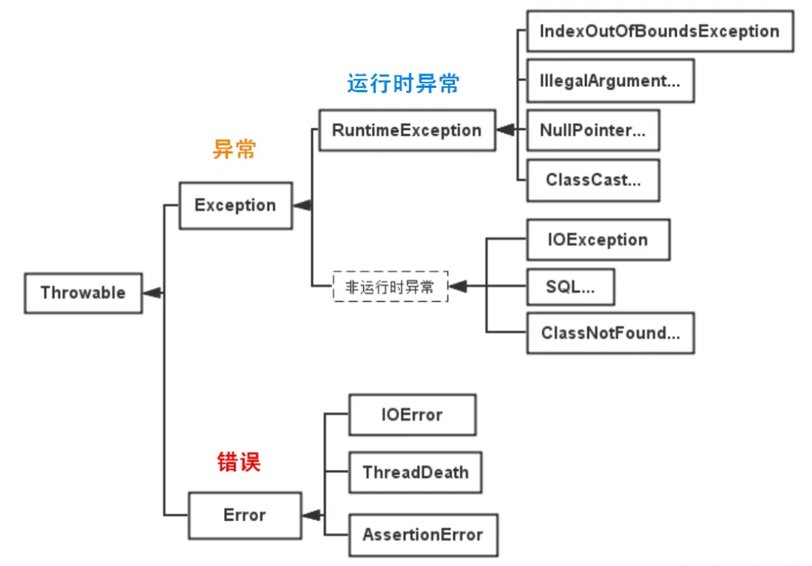

# 背八股笔记 - Java基础篇

原文：https://xiaolincoding.com/interview/java.html

## 一、 Java基础

### 1.1 java三大核心特点？

- **跨平台**（一次编译到处运行）：依赖jvm，源码 -> .class字节码
- **纯面向对象**
- **自动垃圾回收GC**

### 1.2 java优缺点

- 优点：
  - **跨平台**
  - **完善的OO体系**
  - **GC自动内存管理**
  - 强大的**生态系统**：Spring等各种库和工具，企业开发首选
  - 内置**多线程、安全沙箱机制**，适合后端大型服务
  - **稳定性**，版本更新向后兼容
- 缺点：
  - 相比c/c++/rust有JVM开销，**性能偏弱，启动慢**（特别是微服务场景下，启动不如go快）
  - **jvm内存占用**高，对资源有限的环境不太友好
  - 相比python/go，**语法冗余**，样板代码多
  - 面向对象过于严格，函数编程体验不如动态语言
  - 开发效率不如动态语言，编译过程也可能拖慢开发节奏

### 1.3 为什么能跨平台？核心原理

1. 源码`.java`经`javac`编译成**与平台无关的字节码.class**
2. 不同操作系统有**专属JVM**（c/c++，不能跨平台）
3. JVM负责把统一的字节码翻译成当前系统的机器码执行

> 所以跨平台的是字节码/Java程序，JVM本身不跨平台

### 1.4 JDK/JRE/JVM三者层级关系


1. JVM(Java Virtual Machine)：**执行字节码**的运行核心，提供内存管理、GC、安全性等功能，**只负责运行，无工具**
2. JRE(Java Runtime Environment)：**JVM + Java标准类库**；只用来跑Java程序，**无编译、调试工具，是Java程序运行的最小环境**
3. JDK(Java Development Kit)：**JRE + 开发工具**(javac编译器、jdb调试器等)，提供**开发、编译、调试、运行**java程序所需的*
   *全部工具和环境**，开发代码必须安装jdk

### 1.5 jvm 和 java 语言的区别

- java：编程语言，定义语法、关键字、类型，是开发者写代码的规范
- jvm：执行字节码的虚拟平台，不依赖Java语言，kotlin/scala/groovy编译以后都能在jvm跑（流程：java代码 -> javac ->
  .class字节码 -> JVM翻译执行）

### 1.6 java混合编译（javac编译 + JIT即时编译）

分两次编译，兼顾跨平台与速度

1. 前端编译（编译期）：javac：.java -> .class，与系统无关
2. 后端执行（运行期）：

- 解释器：逐条解释字节码，启动快，但重复执行性能差
- JIT编译器：统计热点代码（频繁调用的方法/循环），直接编译成本地机器码缓存，后续调用跳过解释，大幅提速

### 1.7 编译型 vs. 解释型语言

- 编译型：c/c++：**运行前**整体**编译为当前系统机器码**，生成可执行文件，执行快，但跨平台性差
- 解释性：py/js：**运行时****逐行翻译源码**，不生成可执行文件，跨平台性好，执行慢

> java 特殊： 半编译半解释，先编译字节码，运行时解释+JIT

### 1.8 java传参：只有值传递***

java **不存在引用传递**，分两种场景：

1. 基本类型（int/boolean等）：传递**原值副本**，方法内修改副本，原变量完全不受影响。

```java
public static void main(String[] args) {
  int num = 10;
  changeNum(num);
  System.out.println(num); // 输出10
}

public static void changeNum(int a) {
  a = 20; // 仅修改副本
}
```

2. 引用类型（对象/数组）：传递**对象地址的副本**

- 修改副本指向的对象内部属性：原对象同步变化（地址一致）
- 副本重新new新对象：原引用不受影响（只是副本换地址）

```java
public class Person {
  String name;

  Person(String name) {
    this.name = name;
  }
}

public static void main(String[] args) {
  Person p = new Person("A");
  changeName(p);
  System.out.println(p.name);// B
  changePerson(p);
  System.out.println(p.name);// B
}

public static void changeName(Person p) {
  p.name = "B";// 副本和原引用指向同一对象
}

public static void changePerson(Person p) {
  p = new Person("C");// 副本指向新对象，原引用仍指向旧对象
}
```

### 1.9 Java vs python

- Java：静态强类型（编译校验类型）/Python：动态弱类型（运行才校验）
- Java：.java -> .class -> JIT/解释 Python：逐行解释
- java：大型后端，高并发服务/py：数据分析、脚本、AI
- java长期运行更快，py轻脚本开发更快

## 二、数据类型

### 2.1 8大基本数据类型

- 整型：byte(1B)/short(2B)/int(4B)/long(8B)
- 浮点型：float(4B)/double(8B)
- 字符：char(2B)
- 布尔值：boolean(1bit)

### 2.2 long <-> int

- int -> long：自动隐式转换，没有精度丢失，大范围包容
- long -> int：强转，超出int会截断高位

### 2.3 类型转换三种方式

1. 隐式自动转换：小范围->大范围(int->long)
2. 显式强制转换：大范围->小范围(long->int/double->int)，丢失精度/溢出风险
3. 字符串转换：`Integer.parseInt()`/`Double.valueOf()`包装类静态方法

### 2.4 对象引用转换的问题

- 向上转型是自动进行的，而且是安全的

```java
class Animal {
}

class Dog extends Animal {
}

Dog dog = new Dog();
Animal animal = dog;
```

- 但是向下转型需要手动进行，并且存在风险。如果父类对象实际上并不是目标子类的实例，在转型时就会抛出异常：

> 原因是java的对象在运行时会记录其真实类型，当向下转型时，java会检查对象的实际类型与目标类型是否兼容，不兼容就抛出ClassCastException

```java
Animal animal = new Animal();
Dog dog = (Dog) animal; // 运行时抛出ClassCastException
```

解决方式是需要使用`instanceof`检查：

````
if(animal instanceof Dog){
  Dog dog = (Dog) animal; // 只有确认animal是Dog的实例时才进行转型
}
````

### 2.5 浮点数计算为什么要用BigDemical，不用Double

二进制浮点数无法精确表示一些小数（只能表示1/2^n的和的小数）
金融、支付场景必须使用BigDemical，创建时候传入字符串而非double，避免初始化时就失真

### 2.6 <mark>装箱与拆箱

- 装箱：基本类型 -> 包装类`Integer i = 10`(底层是Integer i = Integer.valueOf(10))
- 拆箱：包装类 -> 基本类型`int a = i`(底层是int a = i.intValue())
- 自动装箱循环场景会频繁创建对象，降低程序性能并加重GC负担

```
Integer sum = 0;
for(int i = 1000;i<5000;i++){
    sum+=i;
}
// int result = sum.intValue()+i;Integer sum = Integer.valueOf(result);
// 本例中循环值已超出IntegerCache(default -128-127)范围，因此会创建将近4000个Integer对象
```

### 2.7 <mark>java为什么要有Integer？

- 集合 / 泛型只能存引用类型，不能存 int，必须包装为 Integer
- 提供工具方法：字符串转数字、进制转换等(Collections.sort()/Integer.toString()/stream())

### 2.8 Integer相比int

- 基本类型和引用类型：int不需要实例化，不需要额外的内存分配/Integer需要实例化，需要为对象分配内存，性能上基本数据类型的操作通常比相应的引用类型快
- 自动装箱和拆箱：Integer可实现基本类型<->相应的包装类类型
- 空指针异常：int默认0，Interger默认null，对null拆箱抛出NullPointerException

### 2.9 那为什么还要保留int？

包装类是引用类型：引用和对象本身是分开的(heap)
基本数据类型：变量对应的内存块直接存储数据本身(stack)
因此，读写效率：基本数据类型>包装类，内存占用：Integer=16B,int=4B

### 2.10 <mark>Integer缓存机制

`Integer.valueOf()`内置缓存池，默认缓存**-128~127**的integer对象

- 区间内数字：复用同一个对象，== true
- 超出区间：每次new新对象，== false；比较必须用equals();

## 三、面向对象

### 3.1 怎么理解面向对象？简单说说封装继承多态

对象：属性+行为，面向对象就是以对象为中心，通过对象间的交互来完成程序功能，灵活可扩展  
<mark>面向对象三大特性：封装、继承、多态

- 封装：隐藏内部实现，对外提供getter/setter访问，控制数据修改逻辑，提高安全
- 继承：子类 extends 父类，子类自动共享父类的数据结构和方法，建立类之间的层次关系
- 多态：允许不同类的对象对同一消息做出响应（同一接口，使用不同的实例而执行不同操作）
  - 编译时多态：重载
  - 运行时多态：重写

### 3.2 <mark>多态体现在？

1. 重载Overloading：同一类中同名方法，参数列表不同，编译时确定调用哪一个方法（add(int a,int b);/add(double a,double b);）
2. 重写Overriding：子类提供对父类同名方法的具体实现，运行时根据对象的实际类型确定调用那个版本的方法，这是实现多态的主要方式
   （@override`注解）（例如animal类里面有sound()，Dog类可以重写以实现bark，Cat类可以实现meow）
3. 接口与实现：多个类可以实现同一个接口，并且用接口类型的引用来调用这些方法，可以保持调用方式的一致性
   （dog与cat可以分别实现animal接口的`makesound()`方法）
4. 向上转型

### 3.3 多态解决了什么问题？

提高代码的扩展性和复用性，是很多设计模式、设计原则、编程技巧的代码实现基础

### 3.4 面向对象的设计原则：

SOLID：

1. SRP单一职责原则：一个类负责一项职责；
2. OCP开闭原则：对扩展开放，对修改封闭；
3. LSP里氏替换原则：子对象应该能够替换掉所有父类对象；
4. ISP接口隔离原则：接口应该小而专；
5. DIP依赖倒置原则：高层不应该依赖底层，都是都应该依赖抽象；

### 3.5 抽象类 abstract class vs. 接口 interface

1. 继承限制：类只能单继承抽象类，可多实现接口
2. 构造器：抽象类有构造器（子类super()调用）；接口无构造器
3. 成员变量：抽象类可普通变量/静态变量；接口只能public static final常量
4. 方法：

- 抽象类：抽象方法 + 普通实例方法 + 静态方法
- 接口：Java8 前仅抽象；Java8 默认(default)方法、静态方法；Java9 私有辅助方法

5. 使用场景：抽象类描述同类事物公共模板；接口描述能力规范（可插拔）

### 3.6 抽象类能被final修饰吗？

**不能**，java的抽象类是用来被继承的，final用于禁止类被继承或方法被重写，因此他们是互斥的

### 3.7 抽象类可以被实例化吗？

**不能**，这意味着不能使用new直接创建一个抽象类对象。抽象类主要是为了被继承，其中的抽象方法需要在子类中被实现
抽象类可以有构造器，在子类实例化的时候会被调用，这个过程并不直接实例化抽象类，而是创建子类实例，间接使用抽象类的构造器

```java
public abstract class abs {
  public abs() {
    // 构造器
  }

  public abstract void absMethod();
}

public class cct extends abs {
  public cct() {
    super(); // 调用抽象类的构造器
  }

  @Override
  public void absMethod() {
    // 实现抽象方法
  }
}

cct obj = new cct();
```

### 3.8 接口可以包含构造函数吗？

**不能**，接口不会有自己的实例，所以不需要构造方法。

### 3.9 static 静态变量/静态方法

- 静态变量：属于类，全局唯一，所有对象共享，类加载初始化一次，`类名.变量`访问（适用于在所有对象间共享的数据，如计数器、常量等）
- 静态方法：属于类，可以在不创建实例的情况下调用，不能直接调用实例变量/方法，可以访问其他静态变量/方法，不支持重写，但可以隐藏（常用于助手方法、获取类级别的信息或者不依赖于实例的数据处理）
- 静态代码块：类加载执行一次，初始化静态资源

### 3.10 静态内部类 vs. 非静态内部类

- 非静态内部类（成员内部类）：依赖于外部类的实例，可直接访问外部所有成员；不能定义静态变量/方法(before java16)
- 静态内部类（static修饰）：不依赖外部对象，仅能直接访问外部静态成员；可独立new，适合工具封装，避免内存泄漏

> 非静态内部类可以直接访问外部方法，编译器是怎么实现的？  
> 编译器在生成字节码的时候会为非静态内部类维护一个指向外部类实例的引用，在生成非静态内部类的构造方法时，将外部类实例作为参数传入，并在内部类实例化的过程中建立外部类实例与内部类实例之间的联系，从而实现直接访问外部方法的功能

### 3.11 final 关键字三用法

- final类：禁止被继承，如String
- final方法：禁止子类重写
- final变量：
  - 基本类型：值不可修改
  - 引用类型：地址不可变，但是对象内部属性可以修改

## 四、浅拷贝与深拷贝

### 4.1 区别：

**主要在于对于引用类型字段的处理(共享/复制)

- 浅拷贝：只复制**对象本身以及内部的值类型字段**，但**不复制内部的引用类型字段**(
  值：复制/引用：复制引用到新对象，两个对象指向同一个引用对象)
- 深拷贝：复制对象的同时，**将对象内部的所有引用类型字段也复制一份**，而不共享引用(生成一个全新的对象以及内部所有对象)

### 4.2 实现深拷贝

1. 实现Cloneable接口并重写clone()方法：递归克隆引用字段
2. 使用序列化和反序列化：将对象序列化为字节流，字节流反序列化为对象
3. 手动递归复制

## 五、泛型

### 5.1 什么是泛型？

Java 泛型（Generics）是一种参数化类型机制，可以在类、接口、方法中将数据类型作为参数传入，从而实现代码复用与类型安全。它在
编译期进行类型检查，避免了运行时的 ClassCastException。

### 5.2 为什么需要泛型？

- **适用于多种数据类型执行相同代码**

```java
private static <T extends Number> double add(T a, T b) {
  System.out.println(a + "+" + b + "=" + (a.doubleValue() + b.doubleValue()));
  return a.doubleValue() + b.doubleValue();
}
```

这里的 T 可以为 int/float/double ，有了泛型就不必每种类型都重载一个add方法

- **泛型中的类型在使用时指定，不需要强制类型转换**（类型安全，编译器检查类型）
  例子：

```
List l = new ArrayList();
l.add("string");
l.add(100d);
l.add(new person());
```

上述的l中的元素都是Object类型（无法约束其中的类型），在取出元素的时候就需要强制转化到目标类型，很容易抛ClassCastException异常
引入泛型，就可以提供具体的约束，提供编译前的检查

```java
List<String> l = new ArrayList<>();
```

## 六、对象

### 6.1 创建对象

- 使用new关键字
- 使用Class类的newInstance()方法：

```java
MyClass obj = (MyClass) Class.forName("com.example.MyClass").getDeclaredConstructor().newInstance();
```

java的反射API，在运行时动态地创建对象，不需要在编译时知道具体的类。
[关于反射](#七反射)
> `Class.newInstance()`在JDK 9后已经被标记为过时，因为它只能调用无参构造器，更推荐使用`Constructor.newInstance()`
> ，更强大也更灵活(同样是反射)

```java
Constructor<MyClass> constructor = MyClass.class.getConstructor();
MyClass obj = constructor.newInstance();
```

- 使用clone()方法

通过实现Cloneable接口并重写Object类的clone()方法，可以基于现有对象创建一个新的副本对象
`Object.clone()`默认浅拷贝，对于引用类型的对象复制引用地址而非对象本身，需要深拷贝需要手动实现
[关于clone](#四浅拷贝与深拷贝)

- 使用反序列化

通过`ObjectInputStream`从一个字节流（通常为文件或网络）重建一个对象

```
try(ObjectInputStream ois = new ObjectInputStream(new FileInputStream("person.dat"))) {
    Person restoredPerson = (Person) ois.readObject(); // 创建新对象 
    restoredPerson.sayHello(); // 输出: Hello, David 
} catch (IOException | ClassNotFoundException e) {
    e.printStackTrace(); 
}
```

特点是不会调用构造器，类必须实现`java.io.Serializable`接口

- 使用工厂模式

一种设计模式，不直接使用new，而是通过一个方法来返回对象实例（常见的工厂方法：`getInstance()`/`valueOf()`）

```java
Person p = Person.createPerson("syj");
```

创建/使用分离，降低耦合，隐藏创建对象的复杂逻辑

### 6.2 new 出的对象什么时候回收？

java中对象的回收时机由以下算法决定：
可达性算法（引用链）/终结器（Finalizer，但Java 9后已经被标记为@Deprecated)
> java并不使用引用计数法，因为它无法解决循环引用问题

### 6.3 如何获取私有对象

私有对象被声明为private，只能在其所在的类内部被访问
间接获取的两种方法：

1. 公共访问器方法 getter
2. 反射机制：允许在运行时检查和修改类、方法、字段等信息，通过反射机制可以绕过private限制获取私有对象

```java
class MyClass {
  private String privateField = "私有字段的值";
}

public class Main {
  public static void main(String[] args) throws NoSuchFieldException, IllegalAccessException {
    MyClass obj = new MyClass();
    // 获取 Class 对象
    Class<?> clazz = obj.getClass();
    // 获取私有字段
    Field privateField = clazz.getDeclaredField("privateField");
    // 设置可访问性
    privateField.setAccessible(true);
    // 获取私有字段的值
    String value = (String) privateField.get(obj);
    System.out.println(value);
  }
}

```

## 七、<mark>反射

### 7.1 什么是反射机制？

运行时获取类完整信息，动态创建对象、调用方法、读写私有字段

### 7.2 反射在你平时写代码或者框架中的应用场景有哪些?

- 加载数据库驱动
  我们的项目底层数据库有时是用mysql，有时用oracle，需要动态地根据实际情况加载驱动类，这个时候反射就有用了，假设
  com.mikechen.java.myqlConnection，com.mikechen.java.oracleConnection这两个类我们要用。 这时候我们在使用 JDBC 连接数据库时使用
  Class.forName()通过反射加载数据库的驱动程序，如果是mysql则传入mysql的驱动类，而如果是oracle则传入的参数就变成另一个了。
- 配置文件加载
  Spring 框架的 IOC（动态加载管理 Bean），Spring通过配置文件配置各种各样的bean，你需要用到哪些bean就配哪些，spring容器就会根据你的需求去动态加载，你的程序就能健壮地运行。
  Spring通过XML配置模式装载Bean的过程：
  - 将程序中所有XML或properties配置文件加载入内存
  - Java类里面解析xml或者properties里面的内容，得到对应实体类的字节码字符串以及相关的属性信息
  - 使用反射机制，根据这个字符串获得某个类的Class实例
  - 动态配置实例的属性

```
// 配置信息
className = com.example.reflectdemo.TestInvoke
methodName = printlnState

// 实体类
public class TestInvoke {
    private void printlnState(){
        System.out.println("I am fine");
    }
}

// 解析配置文件方法
// 解析xml或properties里面的内容，得到对应实体类的字节码字符串以及属性信息
public static String getName(String key) throws IOException {
    Properties properties = new Properties();
    FileInputStream in = new FileInputStream("D:/IdeaProjects/AllDemos/language-specification/src/main");
    properties.load(in);
    in.close();
    return properties.getProperty(key);
}

// 反射主调用代码
public static void main(String[] args) throws NoSuchMethodException, InvocationTargetException, IllegalAccessException, InstantiationException, ClassNotFoundException {
    // 使用反射机制，根据这个字符串获得Class对象
    Class<?> c = Class.forName(getName("className"));
    System.out.println(c.getSimpleName());
    // 获取方法
    Method method = c.getDeclaredMethod(getName("methodName"));
    // 绕过安全检查
    method.setAccessible(true);
    // 创建实例对象（Class.newInstance() 已过时，使用 Constructor.newInstance()）
    TestInvoke testInvoke = (TestInvoke) c.getDeclaredConstructor().newInstance();
    // 调用方法
    method.invoke(testInvoke);
}

// 运行结果：
TestInvoke
I am fine
```

## 八、注解

### 8.1 讲一讲java注解的原理？

**注解就是代码上的「标签 / 元数据」**，给类、方法、字段、参数打上标记，可以携带额外信息。

- 注解本身**不会直接执行逻辑**；
- 需要**程序（编译器 / 反射框架）主动去读取注解信息，再执行对应的行为**。

>
> 对比注释：
> 注释：给人看，编译后消失；
> 注解：给程序看，可以保留到运行期，代码可以读取。

注解本质上是一种特殊的接口，它继承自 java.lang.annotation.Annotation 接口，所以注解也叫声明式接口
编译后，Java 编译器会将其转换为一个继承自 Annotation 的接口，并生成相应的字节码文件。

根据注解的作用范围，Java 注解可以分为以下几种类型：

- 源码级别注解 ：仅存在于源码中，编译后不会保留（@Retention(RetentionPolicy.SOURCE)）。
- 类文件级别注解 ：保留在 .class 文件中，但运行时不可见（@Retention(RetentionPolicy.CLASS)）。
- 运行时注解 ：保留在 .class 文件中，并且可以通过**反射**在运行时访问（@Retention(RetentionPolicy.RUNTIME)）。

只有运行时注解可以通过反射机制进行解析。当注解被标记为 RUNTIME 时，Java 编译器会在生成的 .class 文件中保存注解信息。
这些信息存储在字节码的属性表（Attribute Table）中，具体包括以下内容：

- RuntimeVisibleAnnotations ：存储运行时可见的注解信息。
- RuntimeInvisibleAnnotations ：存储运行时不可见的注解信息。
- RuntimeVisibleParameterAnnotations 和 RuntimeInvisibleParameterAnnotations ：存储方法参数上的注解信息。

### 8.2 反射读取注解

只有 `RUNTIME` 级注解，反射才能获取。

```
// 1. 获取类字段
Field field = User.class.getDeclaredField("username");
// 2. 判断是否存在该注解
if(field.isAnnotationPresent(MyFieldAnnotation .class)){
// 3. 获取注解实例
  MyFieldAnnotation anno = field.getAnnotation(MyFieldAnnotation.class);
// 4. 读取注解携带的数据
  String desc = anno.value();
  int len = anno.length();
  System.out.println(desc +" "+len);
}
```

> Spring 底层原理：启动时扫描所有类 → 反射读取类 / 方法上注解 → 根据注解执行逻辑（@Service @Controller）

例子：自定义注解：

```java
import java.lang.annotation.*;

// 元注解
@Target(ElementType.FIELD)    // 只能打在字段上
@Retention(RetentionPolicy.RUNTIME) // 运行时保留，支持反射读取
public @interface MyFieldAnnotation {
  // 注解内的成员，写法类似无参方法，可以指定默认值
  String value() default "";

  int length() default 10;
}

// using annotation:
class User {
  @MyFieldAnnotation(value = "用户名称", length = 32)
  private String username;
}

```

### 8.3 注解的作用域

注解的作用域（Scope）指的是注解可以应用在哪些程序元素上，由元注解 @Target 配合 ElementType 枚举来指定。在 Java 21
中，ElementType 共有 12 种取值：

1. TYPE：类、接口、枚举、注解类型
2. FIELD：字段（包括枚举常量）
3. METHOD：方法
4. PARAMETER：方法或构造器的参数
5. CONSTRUCTOR：构造方法
6. LOCAL_VARIABLE：局部变量
7. ANNOTATION_TYPE：注解类型本身（即元注解）
8. PACKAGE：包（写在 package-info.java 中）
9. TYPE_PARAMETER：类型参数声明（Java 8 新增，用于泛型形参上）
10. TYPE_USE：任何使用类型的地方（Java 8 新增，常用于配合 Checker Framework 做类型检查）
11. MODULE：模块（Java 9 模块系统引入）
12. RECORD_COMPONENT：记录类组件（Java 16 引入 record 时新增）

其中最常用的是 **TYPE、FIELD、METHOD、PARAMETER** 这几种。如果定义注解时不显式指定 @Target，那么该注解默认可以用于上述除
TYPE_PARAMETER 和 TYPE_USE 之外的所有位置

## 九、异常

### 9.1 介绍一下异常：



Java 的异常体系主要基于 Throwable 及其子类。
Throwable 有两个重要的子类：Error 和 Exception，它们分别代表了不同类型的异常情况。

- Error (错误)： 表示运行环境的错误，错误是程序无法处理的严重问题，如虚拟机错误、动态链接库失效等。
  程序不应该尝试捕获这类错误。 例如，OutOfMemoryError、StackOverflowError 等。
- Exception (异常)： 表示程序本身可以处理的异常情况。
  异常分为两大类：
  - 非运行时异常（受检异常，Checked Exception）： 这类异常在编译时就必须被捕获或者声明抛出。它们通常是外部错误，如文件不存在 (
    FileNotFoundException)、类未找到 (ClassNotFoundException) 等。 非运行时异常强制程序员处理这些可能出现的问题，增强了程序的健壮性。
  - 运行时异常（非受检异常，Unchecked Exception 或 RuntimeException）： 这类异常特指 RuntimeException 及其子类。它与 Error
    一起构成了 Java 中的非受检异常家族。运行时异常由程序逻辑错误导致，如空指针访问 (NullPointerException)、数组越界 (
    ArrayIndexOutOfBoundsException) 等。运行时异常是不需要在编译时强制捕获或声明的。

### 9.2 java异常处理

- try-catch块（可带finally）
- throw手动抛出异常
- throws关键字用于在方法声明中声明可能抛出的异常类型，将异常传递给调用者处理

### 9.3 抛出异常为什么不用throws

如果异常是未检查异常或者在方法内部被捕获和处理了，那么就不需要使用throws。

### 9.4 try catch中的语句运行情况

try块中的代码将按顺序执行，如果抛出异常，将在catch块中进行匹配和处理，然后程序将继续执行catch块之后的代码。如果没有匹配的catch块，异常将被传递给上一层调用的方法。

### 9.5 try{return “a”} finally{return “b”}这条语句返回啥

finally块中的return语句会覆盖try块中的return返回，因此，该语句将返回"b"

## 十、Object

### 10.1 Object 11 个核心方法

`equals()、hashCode()、toString()、getClass()、clone()、wait()/wait(long)、notify()、notifyAll()、finalize()`

### 10.2 == 和 equals 区别

1. `==` 运算符

- 基本类型：比较**数值**
- 引用类型：比较**内存地址**

这里有个经典的面试陷阱，就是**字符串常量池**的问题。
String c = "hello";String d = "hello";System.out.println(c == d); // 输出 true
这里为什么 == 比较也是 true 呢？因为当你直接用双引号创建字符串的时候，JVM 会把它扔到一个叫"字符串常量池"
的地方。如果池子里已经有了 "hello"，那 d 就直接复用 c 指向的那个对象，所以它俩地址是一样的，== 自然就返回 true 了。

2. `equals()` 方法

- Object 原生实现等价`==`，只比地址
- String/Integer 等重写后：**对比对象内容**

>
> 业务比较内容一律使用`equals()`，字符串先判空避免空指针。

### 10.3 <mark>equals 与 hashCode 配套重写规则（HashMap 必考）

1. 相等对象（equals=true）：hashCode 必须相等
2. hashCode 相等：对象不一定相等（哈希冲突）
3. 只重写 equals 不重写 hashCode：HashMap/HashSet 会存重复相同业务对象，集合失效

> 比如两个id相同的user对象，equals(根据id)返回true，但hashcode不同，会被当成两个不同元素存入集合

### 10.4 <mark>String / StringBuilder / StringBuffer

表格

| 特性   | String      | StringBuilder | StringBuffer        |
|------|-------------|---------------|---------------------|
| 可变性  | 不可变，修改生成新对象 | 可变 char 数组    | 可变 char 数组          |
| 线程安全 | 天然安全（不可变）   | 不安全，无同步       | 安全，方法加 synchronized |
| 性能   | 频繁拼接极差      | 单线程最优         | 多线程同步损耗，较慢          |
| 场景   | 固定常量字符串     | 单线程频繁拼接       | 多线程字符串拼接            |

## 十一、java 8 新特性

1. Lambda 表达式：简化单方法接口（函数式接口）
2. Stream 流式处理：集合链式过滤、映射、聚合；并行流 parallelStream 利用多线程
3. Optional：解决空指针，优雅判空
4. CompletableFuture：异步编程，解决 Future 阻塞回调地狱
5. 接口默认 / 静态方法、重复注解、方法引用

### 11.1 <mark>lambda表达式

- (parameters) -> expression：当 Lambda 体只有一个表达式时使用，表达式的结果会作为返回值。
- (parameters) -> { statements; }：当 Lambda 体包含多条语句时，需要使用大括号将语句括起来，若有返回值则需要使用 return 语句。

### 11.2 <mark>Stream API

- 例1：从列表中筛选长度大于3的字符串，收集到新列表中
- 没有 Stream API 的做法：

```
List<String> originalList = Arrays.asList("apple", "fig", "banana", "kiwi");
List<String> filteredList = new ArrayList<>();

for (String item : originalList) {
    if (item.length() > 3) {
        filteredList.add(item);
    }
}
```

这段代码需要显式地创建一个新的 ArrayList，并通过循环遍历原列表，手动检查每个元素是否满足条件，然后添加到新列表中。

---

- 使用 Stream API 的做法：

```
List<String> originalList = Arrays.asList("apple", "fig", "banana", "kiwi");
List<String> filteredList = originalList.stream()
        .filter(s -> s.length() > 3)
        .collect(Collectors.toList());
```

这里，我们直接在原始列表上调用 `.stream()` 方法创建了一个流，使用 `.filter()` 中间操作筛选出长度大于 3 的字符串，最后使用
`.collect(Collectors.toList())` 终端操作将结果收集到一个新的列表中。代码更加简洁明了，逻辑一目了然。

- 例2：计算列表中所有数字的总和

  - 没有 Stream API 的做法：

```
List<Integer> numbers = Arrays.asList(1, 2, 3, 4, 5);
int sum = 0;
for (Integer number : numbers) {
    sum += number;
}
```

这个传统的 for-each 循环遍历列表中的每一个元素，累加它们的值来计算总和。

- 使用 Stream API 的做法：

```
List<Integer> numbers = Arrays.asList(1, 2, 3, 4, 5);
int sum = numbers.stream()
        .mapToInt(Integer::intValue)
        .sum();
```

通过 Stream API，我们可以先使用 `.mapToInt()` 将 Integer 流转换为 IntStream（这是为了高效处理基本类型），然后直接调用
`.sum()` 方法来计算总和，极大地简化了代码。

### 11.3 Stream流的并行API是什么？

是 ParallelStream。
并行流（ParallelStream）就是将源数据分为多个子流对象进行多线程操作，然后将处理的结果再汇总为一个流对象，底层是使用通用的
fork/join 池来实现，即将一个任务拆分成多个“小任务”并行计算，再把多个“小任务”的结果合并成总的计算结果

## 十二、序列化

1. 作用：对象转字节流，跨 JVM 网络传输 / 持久化
2. Java 原生序列化缺点：不安全、字节体积大、不跨语言；生产推荐 Protobuf、FastJSON
3. transient/static 修饰字段：序列化时忽略，不存入字节流

在Java中通过序列化对象流来完成序列化和反序列化：
ObjectOutputStream：通过writeObject(）方法做序列化操作。
ObjectInputStrean：通过readObject()方法做反序列化操作。
只有实现了Serializable或Externalizable接口的类的对象才能被序列化，否则抛出异常！

## 十三、设计模式

### 13.1 volatile和synchronized如何实现单例模式

```java
public class SingleTon {
  // volatile 关键字修饰变量 防止指令重排序
  private static volatile SingleTon instance = null;

  private SingleTon() {
  }

  public static SingleTon getInstance() {
    if (instance == null) {
      //同步代码块 只有在第一次获取对象的时候会执行到，第二次及以后访问时 instance变量均非null故不会往里走
      synchronized (SingleTon.class) {
        if (instance == null) {
          instance = new SingleTon();
        }
      }
    }
    return instance;
  }
}
```

正确的双重检查锁定模式需要使用volatile。volatile主要包含两个功能。

- 保证可见性。使用volatile定义的变量，将会保证对所有线程的可见性。
- 禁止指令重排序优化。

由于volatile禁止对象创建时指令之间重排序，所以其他线程不会访问到一个未初始化的对象，从而保证安全性。

---

## 补充核心知识点（面试常问）

`instance = new SingleTon()` 在底层分为3步：

1. 分配内存空间
2. 初始化对象
3. 将instance引用指向分配的内存

不加volatile时，JVM可能发生**指令重排**，执行顺序变成 1→3→2；
线程A执行到3还没初始化完成，线程B判断`instance != null`，直接拿到半初始化的脏对象，产生线程安全问题。
`volatile` 就是阻止这个重排序。

### 13.2 代理模式和适配器模式有什么区别？

代理模式常用于添加额外功能或控制对对象的访问，适配器模式常用于让不兼容的接口协同工作。

### 13.3 责任链模式

责任链模式的使用场景核心很明确，就是一个请求需要多个独立的处理逻辑来承接，同时不想让请求发起方和所有处理者产生强关联，还得让处理流程能灵活调整，简单说就是谁能处理就谁来接手，整个处理顺序和参与节点能按需改动。
比如实际开发里最常遇到的接口请求校验，用户调用我们的接口时，可能得先检查登录状态，再验证
token 是否有效，接着确认接口访问权限，最后还要限制请求频率，这些校验逻辑各自独立，而且不同接口需要的校验步骤不一样，比如登录接口只需要验证验证码，查询用户信息的接口得同时过登录和权限校验。要是不用责任链，就得在每个接口里写一堆
if-else 把这些校验串起来，后续想改某个校验规则，所有相关接口都得动，维护起来特别麻烦。

### 13.4 行为型模式

1. **策略模式**
   消除大量 `if-else / switch`，同一族算法自由切换（支付方式、排序算法）。
2. **责任链模式**
   请求沿着处理链依次传递，每个节点选择处理或放行；举例：网关校验、过滤器链、审批流程。
3. **模板方法模式**
   父类定义固定执行骨架，子类重写部分步骤，控制流程不变。
4. **观察者模式**
   发布 - 订阅模型，事件通知机制；Spring 事件驱动底层就是观察者模式。

## 十四、IO

### 14.1 基础概念

IO = Input/Output，输入输出，作用：**程序和外部设备（文件、网络、控制台）传输数据**。
Java IO 分为两大体系：

1. **传统IO（BIO）**：`java.io` 包，面向流；
2. **NIO（New IO）**：`java.nio` 包，JDK1.4引入，面向缓冲区、通道。

### 14.2 java.io 传统BIO（字节流 / 字符流）

#### 14.2.1 两大分支

✅ **字节流（处理一切：文件、图片、视频、网络），父类抽象类**

- `InputStream` 输入（读）
- `OutputStream` 输出（写）
  常用实现：
  `FileInputStream / FileOutputStream` 文件读写
  `BufferedInputStream` 缓冲包装流

✅ **字符流（只处理文本文件），父类抽象类**

- `Reader` 读
- `Writer` 写
  常用实现：
  `FileReader / FileWriter`、`BufferedReader`

> 区分：
> 字节流：byte[]；字符流：char，自带编码处理。文本优先字符流，二进制文件必须字节流。

### 14.2.2 装饰器模式设计

`BufferedInputStream`、`ObjectOutputStream` 属于**包装流**。
不修改原有流，在外层新增功能（缓冲、序列化），典型**装饰器模式**。

### 14.2.3 BIO 核心特点：同步阻塞

- 一个连接对应一个线程；
- 线程读写数据时，如果没有数据，线程阻塞等待；
- 并发连接多的时候，创建大量线程，开销巨大。

示例：读取文件

```
try(BufferedReader br = new BufferedReader(new FileReader("test.txt"))){
    String line;
    while((line = br.readLine()) != null){
        System.out.println(line);
    }
} catch (IOException e) {
    e.printStackTrace();
}
```

> 推荐使用 try-with-resources 自动关闭流（实现AutoCloseable接口），避免忘记close造成资源泄漏。

---

### 14.3 NIO（java.nio，JDK1.4）

三大核心组件：**Buffer缓冲区、Channel通道、Selector选择器**

1. **Channel 通道**：双向读写（BIO流单向），类似管道
2. **Buffer 缓冲区**：所有数据必须先存入Buffer再读写，底层数组
3. **Selector 多路复用器**：单线程监听多条通道事件

#### NIO特点：同步非阻塞

- 线程不会无限阻塞；没有数据时线程可以去做别的事情；
- **多路复用**：单个线程管理大量网络连接，Netty底层基于NIO。

> 同步：仍然需要线程自己去检查数据是否就绪；
> 非阻塞：没有数据不会卡死线程。

### 14.4 AIO（异步非阻塞 NIO.2，JDK1.7）

Asynchronous IO

- 异步：发起读写操作后线程可以走开；操作系统完成IO后主动回调通知程序。
- API：`AsynchronousFileChannel`
  适合大量长连接场景，Linux下依赖epoll，Windows依靠IOCP；
  **Netty一般不推荐AIO，Windows兼容性差**。

### 14.5 BIO / NIO / AIO 对比（面试必背）

| 模型  | 类型         | 特点         | 适用场景               |
|-----|------------|------------|--------------------|
| BIO | 同步阻塞       | 一线程一连接，并发差 | 连接数量少、简单脚本程序       |
| NIO | 同步非阻塞，多路复用 | 单线程管理大量连接  | 高并发网络通信（Netty、RPC） |
| AIO | 异步非阻塞      | 操作系统完成后回调  | 连接数量极多，文件异步读写      |

### 14.6 高频面试问题整理

#### 14.6.1 字节流和字符流区别

1. 字节流处理字节(byte)，通用所有文件；字符流处理字符，仅文本；
2. 字符流内置编码转换，字节流没有；
3. `Reader/Writer` 底层依然封装字节流+编解码器。

#### 14.6.2 缓冲流作用

减少频繁磁盘IO。一次性读取一大块数据放进内存缓冲区，降低磁盘交互次数，大幅提速。

#### 14.6.3 流为什么要关闭 close()

1. 释放操作系统文件句柄资源；
2. 刷新缓冲区，防止数据残留在内存没有写入文件。

> try-with-resources 语法自动执行close。

#### 14.6.4 NIO 和 BIO 最大区别

BIO面向**流**，单向；NIO面向**Channel+Buffer**，双向；
BIO阻塞；NIO非阻塞 + Selector多路复用，支撑高并发。

#### 14.6.5 什么是多路复用

**一个线程通过Selector同时监视上千条连接通道**，只处理就绪有数据的通道，不用为每条连接新建线程。

### 14.7 延伸

我们平时Web服务、RPC框架（Dubbo、Netty）底层都是 **NIO**；
普通本地小文件读写简单场景，直接使用BIO或者Java8+ `Files` 工具类即可。

## 十五、 拓展

### 15.1 有一个学生类，想按照分数排序，再按学号排序

两种实现方式：

1. **类实现Comparable接口（内置排序规则）**

```
public class Student implements Comparable<Student> {
    private int id;
    private int score;

    // 构造、get/set省略
    @Override
    public int compareTo(Student other) {
        // 分数降序，同分学号升序
        if (this.score != other.score) {
            return Integer.compare(other.score, this.score);
        } else {
            return Integer.compare(this.id, other.id);
        }
    }
}
// 使用
List<Student> students = new ArrayList<>();
Collections.sort(students);
```

2. **外部Comparator（灵活自定义排序，推荐）**
   可随时切换排序逻辑，不用修改实体类。

### 15.2 题目：Native方法解释一下

`native` 修饰的方法，方法无Java实现，底层由C/C++本地代码实现，通过JNI调用系统底层能力。

1. 方法只有声明，没有方法体；

```
public native void nativeFunc();
```

2. 调用流程：

- javac -h 生成JNI头文件；
- C/C++实现对应函数；
- 编译为dll(Windows)/so(Linux)动态库；
- Java通过`System.loadLibrary()`加载库后调用。

3. 用途：访问操作系统底层、硬件、高性能运算（Object.wait/Thread.start都是native）。

### 15.3 题目：Java 进程是怎么跟操作系统交互的？

JVM本身就是操作系统进程，所有交互都通过JVM中转，核心交互渠道：

1. **内存交互**
   JVM启动通过`mmap/brk`系统调用向OS申请堆/栈内存；GC回收内存后还给操作系统。
2. **线程交互**
   传统平台线程1:1映射OS原生线程，Linux调用`pthread_create`创建；Java21虚拟线程由JVM调度，不直接绑定OS线程。
   `synchronized/lock`底层调用OS互斥锁。
3. IO交互
   文件/网络IO调用`read/write/socket/bind`系统调用；NIO依托Linux epoll、Windows IOCP多路复用机制。
4. JNI本地接口
   Java代码通过JNI调用C/C++，C代码可直接调用操作系统原生API。
5. 信号处理
   OS发送kill等信号时，JVM捕获并执行关闭钩子、资源回收逻辑。
6. 运行态区分
   Java代码跑在用户态，IO/内存申请会切换内核态，切换有性能开销，JVM通过缓冲区减少切换次数。

