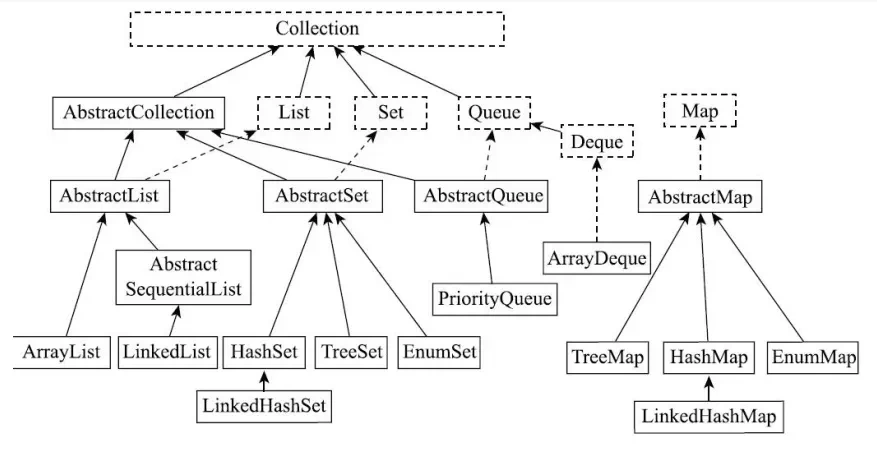

# 背八股笔记 - Java集合篇

原文：https://xiaolincoding.com/interview/collections.html

## 一、先总览一下 Java 集合框架

### 1. Java集合框架概览

Java集合分为两大根接口：

- **Collection**：单列集合，存储单个对象元素
  - List：有序、可重复、支持索引(ArrayList/LinkedList)
  - Set：不可重复(HashSet/LinkedHashSet/TreeSet)
  - Queue：队列
- **Map**：双列集合，存储 key-value 键值对，**不继承Collection**
  - hash数组 + 链表解决哈希冲突：JDK1.8后，在解决哈希冲突时，当**某个桶链表长度>=8&&哈希表数组长度>=64**
    时，才会将该链表转化为红黑树，以减少搜索时间；若数组长度小于64，只扩容而不树化



### 2. Collection 和 Collections 的区别

- `Collection`：**接口**，单列集合顶层父接口，定义add、remove、iterator等方法，实现类有比如List/Set/Queue...
- `Collections`：**工具类**，提供静态方法操作集合：排序、查找、替换、反转、生成同步集合、空集合等。可以对实现了Collection接口的集合进行操作

### 3. 数组和集合的区别，用过哪些集合类？

1. 长度：数组固定；集合动态扩容
2. 存储：数组支持基本类型+对象；集合只能存对象（包装类）
3. 方法：数组方法少；集合提供丰富增删改查、遍历API
4. 访问：数组下标访问；只有List支持下标，Set/Map不支持

用过：

1. ArrayList： 动态数组，实现了List接口，支持动态增长。
2. LinkedList： 双向链表，也实现了List接口，支持快速的插入和删除操作。
3. HashMap： 基于哈希表的Map实现，存储键值对，通过键快速查找值。
4. HashSet： 基于HashMap实现的Set集合，用于存储唯一元素。
5. TreeMap： 基于红黑树实现的有序Map集合，可以按照键的顺序进行排序。
6. LinkedHashMap： 基于哈希表和双向链表实现的Map集合，保持插入顺序或访问顺序。
7. PriorityQueue： 优先队列，可以按照比较器或元素的自然顺序进行排序

### 4. 集合的快速遍历方式

1. 普通for循环：仅List可用
2. 增强for foreach：底层迭代器
3. Iterator迭代器：可安全使用remove()
4. ListIterator：List独有，双向遍历，迭代过程可修改元素
5. Java8 forEach / Stream流

> ⚠️ foreach遍历中直接调用add/remove会触发fail-fast异常

### 5. 快速失败 fail-fast 和安全失败 fail-safe

- **fail-fast（快速失败）**
  ArrayList、HashMap、HashSet。遍历过程集合被修改，通过`modCount`校验抛出`ConcurrentModificationException`。基于原集合遍历。
- **fail-safe（安全失败）**
  CopyOnWriteArrayList。遍历的是底层数组快照，遍历期间修改不会抛异常；读到旧数据，存在弱一致性。

### 6. 线程安全集合分类

#### （1）java.util 原生线程安全（不推荐）

- Vector：数组 List，全部方法`synchronized`，性能差
- Hashtable：哈希 Map，全部方法`synchronized`，不允许 null 键值

#### （2）java.util.concurrent 并发包（推荐高并发）

1. List：`CopyOnWriteArrayList` 写时复制，读多写少场景
2. Set：`CopyOnWriteArraySet`、`ConcurrentSkipListSet`（有序并发 Set）
3. Map：`ConcurrentHashMap`（主流）、`ConcurrentSkipListMap`（有序并发 Map）
4. Queue：`ConcurrentLinkedQueue`无锁 CAS 队列、`BlockingQueue`阻塞队列
5. Duque：`LinkedBlockingDeque`（没有分离读写锁，同一时间仅支持一个线程操作）、`ConcurrentLinkedDeque`（支持多线程同时访问）

> <mark>关于ConcurrentHashMap</mark>  
> 它与 Hashtable 的主要区别是二者加锁粒度的不同，在 JDK 1.7，ConcurrentHashMap 加的是**分段锁**，也就是 Segment 锁，每个
> Segment 含有整个 table 的一部分，这样不同分段之间的并发操作就互不影响。在 JDK 1.8，它取消了 Segment，直接在 **table**
> **元素**（桶的头节点）上加锁，使加锁粒度进一步缩小到单个桶级别。对于 **put 操作**，如果 Key 对应的数组槽位为 null，则通过
> CAS 操作（Compare and Swap）将新节点写入该槽位；如果槽位不为 null（即已存在链表头或红黑树根节点），则对该头节点使用
> **synchronized加锁**，然后遍历桶中的数据执行替换或新增。如果该 put 操作使得当前桶的链表长度超过阈值，则将其转换为红黑树，从而提高查找效率。
---

## 二、List

### ArrayList

#### 1. ArrayList底层原理

底层**动态Object数组**；初始容量10；允许null；有序可重复；线程不安全；随机访问O(1)。

#### 2. ArrayList扩容机制

1. 无参构造：创建空数组，首次add才初始化容量10
2. 扩容新容量 = 旧容量 + 旧容量 >> 1（1.5倍）
3. 通过`Arrays.copyOf`复制数组
4. 更新引用：将ArrayList内部指向原数组的引用指向新数组

> 优化：已知数据量建议指定初始容量，避免多次扩容。

#### 3.<mark>ArrayList线程不安全体现在哪里？

add操作非原子：（判断是否需要扩容 -> size位置设置值 -> 集合大小加一）

1. 并发赋值造成元素覆盖、丢失，size++竞争出现数组空位null（线程1/2都在size位置set值，2覆盖1，两个线程都size++，产生null）
2. 并发扩容可能数组越界（线程1/2都发现不用扩容，1set值后刚好达到最大容量，2再set产生越界）
3. size与add数量不符（size++本身也不是原子操作）

#### 4. <mark>如何将ArrayList变成线程安全？

1. `Collections.synchronizedList()`：方法加锁，锁整个集合，性能较差
2. `CopyOnWriteArrayList`：写时复制，读多写少场景推荐
3. Vector：不推荐，老旧实现，锁粒度大

### LinkedList

#### 1. LinkedList底层原理

底层**双向链表**；有序可重复，允许null；无容量限制；随机遍历O(n)；头尾增删效率高；线程不安全；可当队列、栈使用。

#### 2. ArrayList 和 LinkedList 区别与使用场景

- ArrayList：数组，随机查询；中间插入删除需要移位。**查询多，频繁访问集合元素优先选**，非线程安全
- LinkedList：双向链表，不支持随机查询（需要遍历）；头尾增删快。**大量头尾操作，频繁进行插入删除才选用**，非线程安全

### Vector

#### Vector介绍，为什么不推荐使用

底层数组，功能类似ArrayList；**所有方法加synchronized**，锁粒度大，并发性能差；扩容默认2倍（可指定扩容增量）；属于遗留类。
替代方案：CopyOnWriteArrayList / Collections.synchronizedList。

### CopyOnWriteArrayList

#### 1. CopyOnWriteArrayList底层原理

底层volatile Object数组；保证当前线程对数组对象重新赋值后，其他线程可以及时感知到
**写时复制**：add/remove加锁，复制一份新数组，修改完成替换数组引用；读不加锁，直接访问数组。

#### 2. CopyOnWriteArrayList优缺点 & 使用场景

✅优点：读无锁，并发读性能好；fail-safe不抛并发修改异常
❌缺点：写入需要拷贝数组，内存开销大；遍历读取快照，存在数据延迟
适用：**读多写少**场景（配置、监听器列表）；不适合大数据高频写入。

### 其他

#### 1. list可以一边遍历一边修改元素吗？

取决于遍历方式和具体的list实现类：

1. 普通for：可以，别越界就行
2. foreach：不建议在循环中**修改集合结构(add/remove)**，因为它底层是基于迭代器的，修改集合结构迭代器下一次调用next()会检测到
   `modCount != expectedModCount`，抛出`ConcurrentModificationException`。替换元素(set)没有这个问题。
3. 迭代器：遍历中删除用`Iterator.remove()`，替换用`ListIterator.set()`
4. 对于线程安全的List，如CopyOnWriteArrayList，遍历同时可以修改，不会抛CME，但可能读到旧的数据，因为修改操作是在新的副本上进行的

#### 2. 关于删除？

1. ArrayList：删除元素后会将后续元素向前移动
2. LinkedList：需要先遍历到指定下标位置，然后调整指针
3. CopyOnWriteArraylist：会创建一个新数组，删除操作的时间复杂度取决于数组的复制速度

#### 3. List<>里面填基本数据类型为什么会报错？

`List<>`等泛型集合类要求填充的必须是引用类型（对象类型）
这么设计的原因是：

1. 泛型的类型擦除机制：java泛型在编译后被擦除为Object类型，只能接受引用类型，不接受基本数据类型
2. 历史原因：泛型是后期引入的特性，在基本数据类型和引用类型之间选择只支持引用类型

> 通过使用包装类，结合自动装/拆箱机制，可以很方便的在泛型集合中操作基本数据类型
>

#### 4. List <-> 数组

- List -> 数组：`toArray()`
  - 无参`toArray()`，返回`Object[]`，不推荐，仅适合不确定数组类型的场景
  - 带参`toArray()（T[] a）`，推荐，指定类型

```
User[] userArr = userList.toArray(new User[0]); //传入空数组（推荐），JDK会自动优化长度，也可以传入指定长度数组
```

- 数组 -> List：`Arrays.asList()`
  - 普通对象数组转List

```
List<String> l1 = Arrays.asList(strArr);// 返回固定大小的List（返回的是Arrays内部类而不是ArrayList，不可add/remove）
List<String> l2 = new ArrayList<>(Arrays.asList(strArr));// 如果需要可变List，包装一层ArrayList
```

- 基本类型数组 -> List(有坑)

```
// 错误示例：int[]转List会变成List<int[]>，而非List<Integer>
int[] numArr = {1, 2, 3};
List<int[]> wrongList = Arrays.asList(numArr);

// 正确方式1：手动装箱（JDK8-）
List<Integer> numList1 = new ArrayList<>();
for (int num : numArr) {
    numList1.add(num);
}

// 正确方式2：Stream流（JDK8+）
List<Integer> numList2 = Arrays.stream(numArr).boxed().collect(Collectors.toList());

```

> 基本类型数组直接asList()会把整个数组当成一个元素，必须转换为包装类的List
>

---

## 三、Set

Set特性：元素不可重复；大多线程不安全；允许最多一个null（TreeSet不允许null）。

### HashSet

#### 1. HashSet底层原理

底层封装**HashMap**；存入元素作为map的key，value是静态常量Object。

#### 2. HashSet如何保证元素不重复？

添加元素流程：

1. 获取元素hashCode定位哈希桶
2. 桶内遍历，使用equals比较对象
3. hashCode相同 && equals相等 → 判断重复，不存入

> 规范：重写equals必须重写hashCode。

### LinkedHashSet

继承HashSet，底层LinkedHashMap；**双向链表维护插入顺序**；性能略低于HashSet。

### TreeSet

#### 1. TreeSet底层原理

底层封装**TreeMap（红黑树）**。

#### 2. TreeSet排序规则

两种排序方式：

1. 自然排序：元素实现`Comparable`接口重写compareTo
2. 定制排序：构造传入`Comparator`比较器
   依靠compare返回值去重，**不依赖equals**；key不能为null。

---

## 四、Map【面试重中之重】

### HashMap

#### 1. HashMap底层数据结构（JDK1.7 / JDK1.8）

- JDK1.7：数组 + 单向链表，头插法；并发扩容存在环形链表死循环
- JDK1.8：数组 + 链表 + 红黑树；**尾插法**，解决环形链表问题；依旧线程不安全

> 常见用法：put/get/containsKey
>

#### 2. <mark>HashMap put()流程

1. 计算hashcode，定位桶下标
2. 桶为空：直接放入新Node
3. 桶不为空：

- 头节点key相等 → 覆盖value
- 是红黑树 → 存在相同则取代；不存在则树中插入
- 是链表 → 尾部遍历，存在相同key覆盖；不存在则尾部新增

4. 链表长度≥8且数组长度≥64 → 树化
5. size自增，超过阈值（容量*0.75）触发扩容
6. <mark>扩容操作：

- 创建一个新的两倍大小的数组
- 遍历旧数组中的每个键值对，根据`(e.hash & oldCap)`的结果重新分配到新数组中的位置（原位置或加上oldCap），无需重新计算hash
- 更新HashMap的数组引用和阈值参数

7. 完成添加操作。

> HashMap是非线程安全的，多线程下需要采取额外的同步措施or使用ConcurrentHashMap

#### 3. HashMap get()流程

1. key -> hash定位桶位置
2. 桶为空返回null
3. 头节点key匹配(equals()方法)直接返回value
4. 红黑树执行树查找；链表循环遍历匹配key
5. 匹配成功返回value，否则null

> get方法不一定安全：    
> NullPointerException: HashMap == null 任何方法都会抛出NPE，key为null无影响（HashMap明确支持null键值，0号桶）  
> 线程安全：HashMap本身不是线程安全的，比如一个线程调用get()，另一个线程修改了结构（增删），可能抛出CME
>

#### 4. <mark>容量为什么必须是2的幂？

下标计算：`hash & (length - 1)`

1. 位运算代替取模（length-1二进制低n位全1，&相当于取模），效率更高
2. length - 1 二进制低 n 位全 1，哈希散列更均匀，减少冲突（带0会导致&后永远是0，浪费数组空间，大大增加哈希碰撞的概率）
3. 扩容时可以快速判断新下标，不用重新算hash，仅通过高位判断就能快速确定新索引：原下标 / 原下标+旧容量

```text
oldCap = 16 (0001 0000)
hash = 20 (0001 0100)，旧索引 20 % 16 = 4；
hash & oldCap = 0001 0000 = 16 != 0(说明那一个高位是1，新索引=旧索引+oldCap：4+16=20)
```

#### 5. 负载因子为什么是0.75？

负载因子 = 元素数量 / 数组容量，默认0.75。
平衡内存占用与哈希冲突概率：
太小→频繁扩容浪费内存；太大→链表过长查询变慢。

#### 6. 链表转红黑树阈值为什么是8？

泊松分布统计，链表长度到达8概率极低；
短链表遍历开销低于红黑树；过长链表才树化优化查询。

#### 7. 红黑树退化成链表阈值为什么是6？

避免频繁树化、退化的震荡（阈值8和7容易反复转换），设置差值缓冲。

#### 8. 为什么选红黑树而不选AVL树？

AVL树高度严格平衡，增删频繁旋转；
红黑树弱平衡，旋转次数更少；综合读写性能更适合哈希表。

#### 9. HashMap的key能否为null？

允许，null hash值置0，放在0号桶；只能存在一个null key；value允许多个null。

#### 10. <mark>重写equals必须重写hashCode？

契约：equals相等的对象，hashCode必须相等。HashMap在比较元素时，会先通过hashCode进行比较，相同的情况下再通过equals进行比较。
只重写equals：相同业务对象hash不同，存入不同哈希桶，无法去重，HashMap出现重复key。

#### 11. HashMap多线程下存在什么问题？

JDK1.7：扩容头插法产生环形链表，get死循环
JDK1.8：消除环形链表；但并发put会产生数据覆盖、元素丢失；**线程不安全，不能多线程共用**。

#### 12. 为什么String适合做key？

string对象不可变，保证了key的稳定性。若key可变可能导致hashCode和equals()方法不一致，影响map的正确性。

### Hashtable

#### Hashtable特点，与HashMap对比

1. 方法加`synchronized`，线程安全；锁整张哈希表（任何时刻**只能有一个线程**可以操纵hashtable），性能差
2. key、value**都不允许null**
3. 初始容量11，扩容 `2*n+1`

### ConcurrentHashMap

#### 1. JDK1.7实现原理

**分段锁Segment**：内部多个独立Segment，每个Segment相当于小型Hashtable；Segment持有ReentrantLock(可重入锁)
；不同Segment可并发写入，提升并发度。

#### 2. JDK1.8实现原理

废弃Segment；结构和HashMap一致（数组+链表+红黑树）

- 桶为空：CAS自旋写入(Compare & Swap，乐观锁，假设冲突少，在提交时检测冲突，无需阻塞)
- 桶不为空：锁住链表/红黑树**头节点synchronized**(悲观锁，假设数据冲突会发生，在操作前加锁阻塞其他进程)
  锁粒度细化到单个哈希桶，并发性能大幅提升。

#### 3. ConcurrentHashMap为什么不允许key/value为null？

并发环境下无法区分：返回null是key不存在，还是key对应value本身就是null，存在歧义。

#### 4. HashMap、Hashtable、ConcurrentHashMap三者对比

- HashMap：默认容量16，二倍扩容，不安全，允许null键值，性能高，单线程使用
- Hashtable：默认容量11，2n+1扩容，全表synchronized，不允许null，性能差，淘汰
- ConcurrentHashMap：分段锁/桶锁并发安全，高并发首选，不允许null

### LinkedHashMap

#### LinkedHashMap原理，如何实现LRU

继承HashMap，维护双向链表记录顺序；支持插入有序 / 访问有序。
重写`removeEldestEntry`方法，可实现LRU最近最少使用缓存淘汰策略。

#### TreeMap

底层红黑树；按键排序；key必须实现Comparable或传入Comparator；线程不安全。

#### Map的遍历方式

1. for-each & entrySet() 推荐，同时获取key、value

```text
for(Map.Entry<String, String> entry : map.entrySet());
```

2. keySet()，只需要遍历键值可以用

```text
for(String key : map.keySet());
```

3. Iterator迭代器，遍历时支持安全删除

```text
Iterator<Entry<String, String>> it = map.entrySet().iterator();
while(it.hasNext()){
    Entry<String, String> entry = it.next();
    // do something...
}
```

4. map.forEach lambda（Java8）

```text
map.forEach((key, value) -> System.out.println(key + "," + value));
```

5. Stream API

```text
map.entrySet().stream().forEach(entry -> do something);
map.entrySet().stream().filter(entry -> entry.getValue() > 1).collect(Collectors.toMap(Map.Entry::getKey, Map:Entry::getValue));
```

---

## 五、Queue 队列

### 1. Queue常见实现类

分为普通队列、双端队列、优先队列、并发队列、阻塞队列。

### 2. ArrayDeque

底层数组实现双端队列；比LinkedList用作栈、队列性能更好；不支持null。

### 3. PriorityQueue优先队列

底层堆（最小堆）；元素自动排序；线程不安全；不允许null。

### 4. ConcurrentLinkedQueue

无锁并发队列，CAS实现；非阻塞；高并发生产消费。

### 5. BlockingQueue阻塞队列及常见实现

线程空取、队满放入会阻塞；用于生产者消费者模型。
常见：ArrayBlockingQueue、LinkedBlockingQueue、SynchronousQueue等。

---


