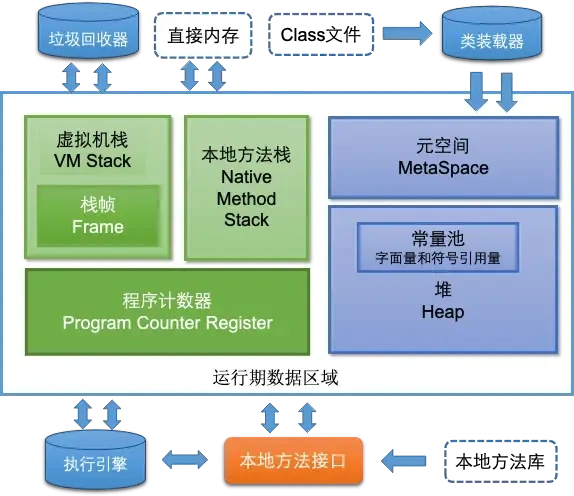
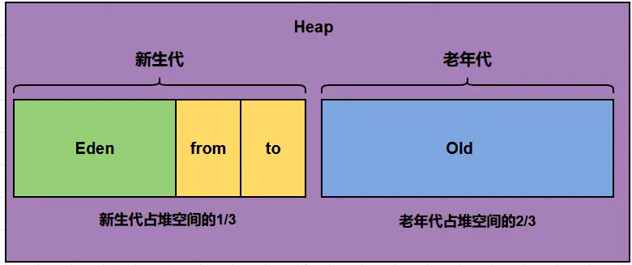
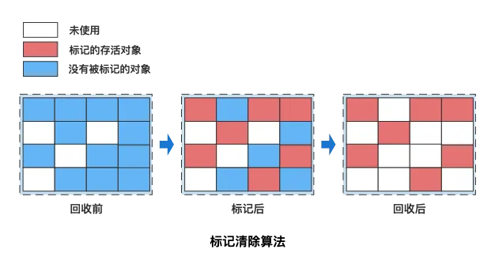
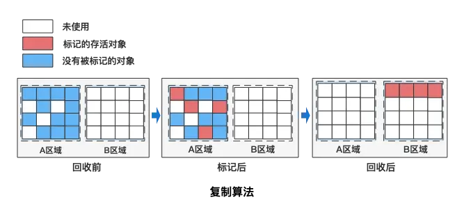
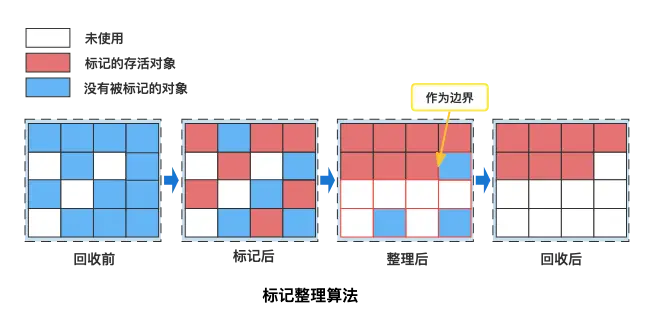

# 背八股笔记 - JVM篇

## 前言

1. JVM运行时内存结构（堆/栈/元空间）
2. 垃圾回收：可达性分析、GC算法、CMS/G1/ZGC回收器
3. 类加载流程 + 双亲委派模型
4. 内存溢出/泄漏区分、线上排查方案

## 一、内存模型（运行时数据区）

### 1. JVM的内存模型介绍一下



JDK8规范下，JVM运行时内存分为5个核心区域，外加堆外直接内存：

1. **程序计数器（线程私有）**
   当前线程字节码行号指示器，native方法时值undefined；

- 不会抛出OutOfMemoryError/StackOverflowError，生命周期和线程绑定。

2. **Java虚拟机栈（线程私有）**
   每个方法执行创建一个**栈帧**，存放局部变量表、操作数栈、动态链接、返回地址；

- 异常：递归过深→StackOverflowError；线程过多栈扩容失败→OOM。

3. **本地方法栈（线程私有）**
   服务native本地方法，HotSpot中和虚拟机栈合并，异常同虚拟机栈。

/*************************************************/

4. **Java堆（所有线程共享）**
   JVM最大内存区域，所有对象/数组都分配在堆中；是内存管理中最大的一块，**javaGC主要针对堆进行。**  
   分新生代(Eden、From、To)、老年代；堆内存耗尽抛出`java.lang.OutOfMemoryError: Java heap space`。
5. **元空间（方法区，线程共享，JDK8替代永久代）**
   使用操作系统本地内存，存储类信息、常量、静态变量；  
   内存不足抛出`java.lang.OutOfMemoryError: Metaspace`。
6. **运行时常量池**
   存储编译期生成的各种**字面量和符号引用**，jdk8之前放在方法区，jdk8将运行时常量池**存放在堆中**。
7. **直接内存（堆外内存，不属于运行数据区）**
   NIO的ByteBuffer使用，不受堆内存限制，分配过大报`Direct buffer memory` OOM。

### 2. 堆和栈有什么区别

| 维度   | 栈（虚拟机栈）                    | 堆                  |
|------|----------------------------|--------------------|
| 存储内容 | 局部变量、对象引用（**不存对象本身**）      | 所有对象实例、数组          |
| 线程   | 线程私有，互不干扰                  | 全局线程共享             |
| 生命周期 | 方法执行完栈帧立刻销毁                | 对象无引用后GC回收，生命周期不确定 |
| 速度   | 读写更快                       | 较慢，需要GC管理          |
| 溢出异常 | StackOverflowError / 线程OOM | 堆OOM               |

> 核心区别一句话：栈存引用，堆存对象；栈私有快，堆共享慢。

### 3. 栈中存指针还是对象？

栈只存**对象引用（指针）**，对象实体永远在堆；
示例：`User u = new User()`
栈变量u存堆对象地址，真正User实例在堆。

### 4. 堆分为哪几部分



1. **新生代 Young（占堆1/3，Eden:From:To = 8:1:1）**

- Eden：新对象优先分配，填满触发Minor GC；
- From/To Survivor：Minor GC存活对象复制到另一块Survivor，轮换使用。

2. **老年代 Old（占堆2/3）**
   多次GC存活对象晋升，大对象直接分配到老年代；Major/Full GC耗时更长。
3. G1特有：Humongous超大分区
   对象大小超过Region一半，直接分配超大分区，减少复制开销。

### 5. 大对象分配在哪里

默认直接分配到老年代。
原因：

1. 新生代空间小，大对象极易频繁触发Minor GC；
2. 频繁复制大对象产生巨大性能损耗；
3. 避免新生代大量内存碎片。

### 6. 程序计数器为什么线程私有

CPU时间片轮转调度，多线程交替执行；线程切换时需要保存当前执行字节码位置，每个线程执行指令不同，必须独立计数器保存断点。

### 7. 方法区存储内容

类结构信息、方法字节码、静态变量、运行时常量池、符号引用、JIT机器码缓存。
运行时常量池支持动态添加（`String.intern()`）。

### 8. String字符串存哪里

JDK6：字符串常量池在永久代；
JDK7及以后，字符串常量池移至堆内存。

### 9. String s = new String("abc")内存分布

1. 先去常量池查找"abc"：不存在则在堆常量池创建字符串；
2. new String()会**再在堆创建一个全新String对象**；
   结果：

- 常量池无"abc"：创建2个字符串对象；
- 常量已有：仅new出1个对象。

### 10. 四种引用及区别

1. **强引用** `Object o = new Object()`
   只要存在引用，GC永远不回收，日常代码默认方式。
2. **软引用 SoftReference**
   内存溢出前才回收，适合缓存。
3. **弱引用 WeakReference**
   下一次GC必然回收，典型应用：ThreadLocal、缓存。
4. **虚引用 PhantomReference**
   必须配合引用队列，用于监控堆外内存回收。

### 11. 弱引用使用场景（代码示例）

```
import java.lang.ref.WeakReference;
import java.util.HashMap;
public class CacheExample {
    private Map<String, WeakReference<MyHeavyObject>> cache = new HashMap<>();
    public MyHeavyObject get(String key) {
        WeakReference<MyHeavyObject> ref = cache.get(key);
        if(ref != null && ref.get() != null){
            return ref.get();
        }
        MyHeavyObject obj = new MyHeavyObject();
        cache.put(key, new WeakReference<>(obj));
        return obj;
    }
    // 10MB大对象
    static class MyHeavyObject{
        byte[] buf = new byte[1024*1024*10];
    }
}
```

用途：内存紧张时自动释放缓存，避免内存泄漏。

### 12. 内存泄漏 VS 内存溢出

#### 内存泄漏（Memory Leak）

无用对象持续持有强引用，GC无法回收，内存缓慢上涨，最终引发OOM。
常见场景：

1. static集合长期存放对象；
2. 未关闭IO/数据库连接；
3. ThreadLocal使用后不remove。

#### 内存溢出 OOM

JVM申请内存时无可用空间，直接抛出Error。

> 内存泄漏 vs 内存溢出：泄漏是对象该回收但回收不了（引用未释放），溢出是内存确实不够用。泄漏积累最终导致溢出。

### 13 四类OOM异常

1. `Java heap space`：堆内存不足（对象过多/泄漏）；
2. `StackOverflowError`：栈递归过深；
3. `Metaspace`：加载类过多，元空间耗尽；
4. `Direct buffer memory`：NIO堆外内存分配过多。

### 14 堆溢出排查步骤

1. JVM参数配置dump快照：

```
-XX:+HeapDumpOnOutOfMemoryError -XX:HeapDumpPath=heap.hprof
```

2. 使用MAT/JProfiler分析hprof文件；
3. 定位：

- 内存泄漏：清理长期持有的静态集合、ThreadLocal；
- 内存不足：调整`-Xms -Xmx`扩容，分批加载数据。

### 15 栈溢出 StackOverflow

触发：无终止递归、单个方法局部变量/超大数组过多；
解决：

1. 改递归为循环；
2. `-Xss`调大栈容量（不推荐，会减少线程上限）。

### 16 经典内存泄漏案例1：静态集合

```
public class StaticTest {
    // static集合全局存活，对象永远无法回收
    public static List<Double> list = new ArrayList<>();
    public void addData(){
        for(int i=0;i<10000000;i++){
            list.add(Math.random());
        }
    }
    public static void main(String[] args){
        new StaticTest().addData();
    }
}
```

优化：取消static，业务完成清空集合。

### 17 经典内存泄漏案例2：ThreadLocal

底层：Thread的ThreadLocalMap key是弱引用，value是强引用；
线程不销毁时，key被GC后value永远无法释放，造成泄漏。
标准规范写法：

```
try {
    threadLocal.set(数据);
    //业务逻辑
}finally {
    threadLocal.remove(); //必须手动清理
}
```

## 二、类加载机制

### 1 new创建对象完整流程

1. new指令触发，常量池查找类符号引用，执行类加载；
2. 堆分配空白内存；
3. 内存全部置零（成员变量默认值）；
4. 填充对象头（哈希、锁、分代年龄、类型指针）；
5. 执行`<init>`构造方法初始化。

### 2 简述JVM类加载过程

- 1）加载：
  - 通过全类名获取类的二进制字节流。
  - 将类的静态存储结构转化为方法区的运行时数据结构。
  - 在内存中生成类的Class对象，作为方法区数据的入口。
- 2）验证：对文件格式，元数据，字节码，符号引用等验证正确性。
- 3）准备：在方法区内为类变量分配内存并设置为0值。
- 4）解析：将符号引用转化为直接引用。
- 5）初始化：执行类构造`<clinit>()`方法，真正初始化。

### 3 四类类加载器（双亲委派层级）

1. **启动类加载器 Bootstrap ClassLoader**
   C++实现，加载/lib下的jar包和类，`getClassLoader()`返回null；
2. **平台/扩展类加载器 Platform(Ext)**
   Java实现，加载/lib/ext下的jar包和类；
3. **应用类加载器 AppClassLoader**
   Java实现，加载项目classpath下的jar包和类；
4. **自定义类加载器**
   加载加密class、网络字节码等场景。

### 4 双亲委派模型定义

类加载器收到加载请求，先委派父加载器处理，父加载器找不到字节码，自身才加载。
执行顺序：自定义 → App → Ext → Bootstrap。

### 5 双亲委派两大核心作用（为什么要有双亲委派）

1. 安全防护：防止自定义java.lang.String等核心类篡改；
2. 类唯一性：保证一个类全局只加载一次，节省内存。

### 6 类完整生命周期（7阶段）

加载 → 链接（验证、准备、解析） → 初始化 → 使用 → 卸载

1. **加载**：读取class字节码，生成Class对象放入方法区；
2. **验证**：校验字节码合规，防止恶意代码；
3. **准备**：静态变量分配内存，赋默认零值（final常量直接赋值）；
4. **解析**：常量池符号引用转为内存直接引用；
5. **初始化`<clinit>()`**：执行静态变量赋值、静态代码块；父类优先初始化；
6. 使用：new对象、调用静态方法；
7. **卸载（条件苛刻）**
1. 该类所有实例全部回收；
2. 加载该类的ClassLoader被回收；
3. Class对象无任何强引用。

## 三、垃圾回收 GC

### 1 GC作用、触发时机

自动识别并回收无引用对象占用的内存，释放堆内存；
触发：

1. Eden填满→Minor GC；老年代不足→Major/Full GC；
2. 代码调用`System.gc()`（仅建议，不保证执行）；
3. 元空间/直接内存耗尽触发Full GC。

### 2 判断对象是否为垃圾：两种算法

1. **引用计数法（JVM不使用）**
   对象引用+1/释放-1，0则回收；致命缺陷：循环引用无法清理。
2. **可达性分析（HotSpot默认）**

从GC Roots向下遍历引用链，不可达对象判定垃圾。
GC Roots包含：

- 虚拟机栈**局部变量**；
- 方法区**静态属性**引用的对象；
- 方法区**常量**引用的对象；(例如字符串常量池里的引用)
- 本地方法栈中JNI（Java Native Interface）本地引用；
- **synchronized锁**持有对象。
- 反应JVM内部情况的JNIHandles全局引用（如基本数据类型对应的Class对象、常驻异常对象、系统类加载器等）

### 3 三大基础GC算法

#### 标记-清除


流程：标记垃圾→统一清除；
缺点：大量内存碎片，大对象分配失败频繁GC。

#### 复制算法


内存分两块，存活对象复制到空白区，清空原内存；
无碎片，代价浪费一半内存，新生代专用（对象存活率低）。

#### 标记-整理


标记后存活对象向内存一端压缩，边界外全部回收；
无碎片，移动对象STW停顿长，老年代使用。

### 4 分代回收思想

对象生命周期长短差异巨大，分区域使用对应算法：

1. 新生代（短寿命）：复制算法，Minor GC频繁、停顿短；
2. 老年代（长寿命）：标记清除/整理，GC少、停顿久。

### 5 主流垃圾回收器对比

1. Serial/SerialOld：单线程，小客户端程序；
2. ParNew：CMS配套新生代收集器（JDK14废弃）；
3. Parallel Scavenge+Parallel Old：吞吐量优先，后台批处理；
4. **CMS**：低延迟老年代收集，标记清除，内存碎片多，JDK14移除；
5. **G1**（JDK9默认）：分区Region，兼顾停顿与吞吐量，无内存碎片；
6. ZGC/Shenandoah：微毫秒级停顿，超大堆低延迟业务。

### 6 Minor / Major / Full GC区别

1. Minor GC：**仅新生代**，**Eden满触发**，将eden区和一个surviovr区的存活对象移动到另一个survivor区或老年代。比较频繁，STW很短；
2. Major GC：仅老年代回收；
3. Full GC：**整堆（年轻代加老年代）**（通常伴随元空间，fullGC期间JVM可能会对元空间中无用的类信息进行卸载）全部回收，STW时间极长，线上必须尽量避免。

**Full GC触发场景**：

- **空间分配担保失败**：minorGC前jvm会检查老年代连续空间是否大于“新生代所有对象之和”或“历次晋升对象平均大小”，都不满足将触发fullGC；Minor
  GC存活对象无法放入老年代；
- **CMS并发失败**：Concurrent Mode Failure（老年代被并发标记/清理速度跟不上分配速度被填满）/Promotion
  Failure（晋升时老年代连续空间不足），会回退为fullGC；
- 手动`System.gc()`（不保证立即执行）；
- 元空间内存耗尽。

### 7 CMS VS G1核心区别

#### CMS

CMS垃圾收集器**注重最短时间停顿**。CMS垃圾收集器为最早提出的并发收集器，垃圾收集线程与用户线程同时工作。

- 采用**标记清除**算法，会产生内存碎片。该收集器分为**初始标记、并发标记、重新标记、并发清除、并发重置**这么几个步骤。
- 主要针对老年代，需配合serial/parnew使用

步骤：

- 初始标记：暂停其他线程(stop the world)，标记与GC roots直接关联的对象。
- 并发标记：可达性分析过程(程序不会停顿)。
- 重新标记：查找执行并发标记阶段从年轻代晋升到老年代的对象，重新标记，暂停虚拟机（stop the world）扫描CMS堆中剩余对象。
- 并发清除：清理垃圾对象，**(程序不会停顿)**。
- 并发重置，重置CMS收集器的数据结构。

#### G1

和Serial、Parallel Scavenge、CMS不同，G1垃圾收集器把堆划分成**多个大小相等的独立区域（Region）**，**新生代和老年代不再物理隔离
**。通过引入
Region 的概念，从而将原来的一整块内存空间划分成**多个的小空间**，使得每个小空间可以单独进行垃圾回收。

- G1收集器**可预测垃圾回收的停顿时间**（建立可预测的停顿时间模型）
- G1从局部（两个Region之间）看是**复制算法**，整体上看效果等同于**标记整理算法**，不会产生内存碎片。分配大对象时，会使用Humongous
  Region安置。

步骤：

- 初始标记：标记与GC roots直接关联的对象。
- 并发标记：可达性分析。
- 最终标记：对并发标记过程中，用户线程修改的对象再次标记一下。
- 筛选回收：对各个Region的回收价值和成本进行排序，然后根据用户所期望的GC停顿时间制定回收计划并回收，**(STW加并行复制)**。

### 8 G1核心特点

1. 堆切分大量独立Region，弱化分代；
2. 优先回收垃圾最多的分区，回收效率更高；
3. 可设置预期停顿时间，控制STW时长；
4. 整体标记整理，不会产生内存碎片。

### 9 GC哪些阶段会STW

1. 所有GC的初始标记、再标记/最终标记（必须暂停用户线程遍历GC Roots）；
2. G1筛选回收、复制存活对象阶段STW；
3. Full GC全程STW。

### 10 GC只回收堆吗

不是，元空间无用类、常量也会在Full GC中尝试卸载回收。
