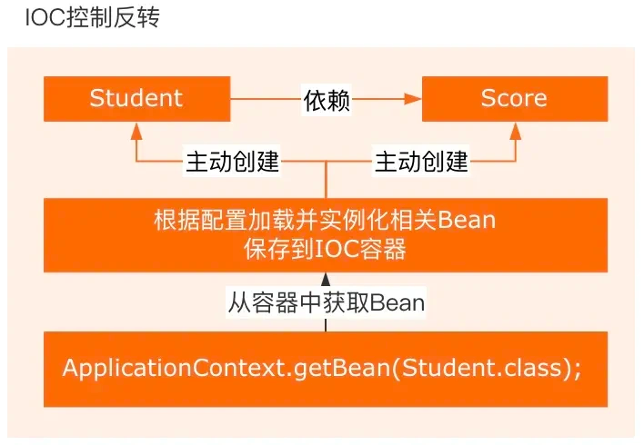
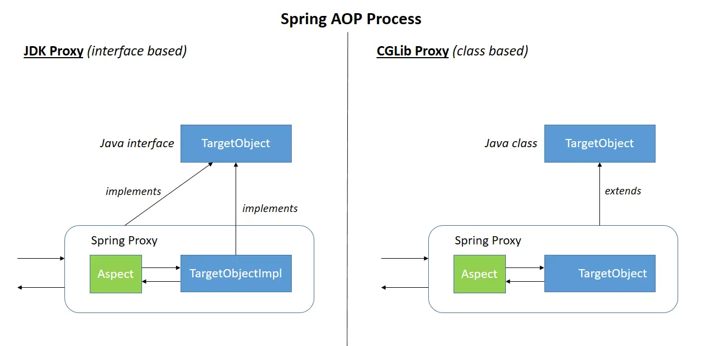

# Spring 八股

## 1. IoC & AOP

### 1.1. IoC 底层实现原理

IoC(Inversion of Control，控制反转) 是 Spring 框架的核心概念之一，它**将对象的创建和管理交给 Spring 容器**
来处理，而不是由开发者在代码中直接创建和管理对象。这样可以**降低对象之间的耦合度**，提高代码的可维护性和可测试性。

IoC 的底层实现原理主要包括以下几个方面：

1. **反射**：Spring 容器通过反射机制来创建和管理 Bean 实例。[关于反射](/_posts/2026-07-21-bagu-JavaBasic.md#七反射)
2. **依赖注入(DI)**：是IoC的核心概念，**将对象的创建和依赖关系的管理交给Spring容器来完成**
   。类只需要声明自己依赖的对象，容器会在运行时将这些依赖对象注入到类中，从而降低了类与类的耦合度。
3. **设计模式-工厂模式**：IoC容器基于工厂模式实现，负责创建和管理Bean实例。
4. **容器实现**：Spring IoC容器是实现IoC的核心，通常使用BeanFactory（基本）/ApplicationContext（扩展）
   

通过这些机制，Spring 实现了 IoC 的核心思想——将对象的创建和管理交给容器来处理，使得开发者可以更加专注于业务逻辑的实现。

### 1.2. 三种依赖注入方式区别

- **构造器注入**：通过构造函数传递依赖对象，保证对象初始化时依赖已就绪
- **Setter方法注入**：通过Setter方法传递依赖对象，灵活性高（允许在对象创建后修改依赖关系），但是依赖可能未完全初始化
- **字段注入**：直接通过`@Autowired`注解作用于字段来传递依赖对象，使用简单但不利于测试和维护

### 1.3. AOP 底层实现原理

AOP(Aspect Oriented Programming，面向切面编程) 是 Spring 框架的另一个核心概念，能够将那些与业务无关，却**为业务模块所共同调用的逻辑封装起来
**，以**减少系统的重复代码，降低模块间的耦合度**。

AOP 的实现依赖于**动态代理技术**：在运行时动态生成代理对象，而不是在编译时。允许开发者在运行时指定要代理的接口和行为，从而在不改变源码的情况下增强方法的功能。
AOP支持两种动态代理：

- JDK动态代理：**要求目标对象至少实现一个接口**，动态代理会**创建一个实现了相同接口的代理类**，然后在**运行时动态生成该类的实例
  **。（实现核心是`java.lang.reflect.Proxy`和`java.lang.relect.InvocationHandler`）
- CGLIB动态代理：CGLIB（Code Generation Library）是一个强大的高性能代码生成库，可以在**运行时动态生成一个目标类的子类**
  。CGLIB代理**不需要目标类实现接口**，而是**通过继承方式创建代理类**。
  

通过这些机制，Spring 实现了 AOP 的核心思想——将横切关注点与业务逻辑分离，使得开发者可以更加专注于业务逻辑的实现。

### 1.4. AOP的应用

- 事务管理：通过AOP可以实现声明式事务管理(`@Transactional`)，无需在业务代码中显式处理事务的开始、提交和回滚。
- 权限校验：利用AOP可以在方法执行前后进行权限检查，确保只有具有相应权限的用户才能访问特定资源。
  - 比如在方法执行前使用`@Before`检查用户的登录状态或权限，不满足就抛出异常阻止方法执行，避免在每个接口都写权限判断
- 日志记录：AOP可以自动为方法调用添加日志记录功能，便于问题排查和系统监控。

## 2. 循环依赖和三级缓存

### 2.1. Spring是如何解决循环依赖问题的？

循环依赖指的是两个类中的属性互相依赖对方，比如A类有B属性，B类有A属性，从而形成了一个依赖闭环

> 前提：**只解决单例 bean 的 setter 注入循环依赖；构造器注入、多例 bean 无法解决**

#### 核心原理：三级缓存

```
1. singletonObjects      一级缓存：完整初始化好的，可用的单例Bean（成品）
2. earlySingletonObjects 二级缓存：实例化完成，但还没填充属性，未初始化的Bean（半成品）
3. singletonFactories    三级缓存：Bean工厂对象，用来暴露半成品Bean（工厂）
```

#### 流程举例：A依赖B，B依赖A

1. 开始实例化A（new A），**A对象创建出来了，但属性还没注入**
2. A把`ObjectFactory`（获取A半成品的工厂）放入**三级缓存**，这个工厂的任务是：当其他Bean需要引用BeanA时，他能动态返回当前这个半成品BeanA（状态是已实例化但未初始化）
3. 填充A的属性，发现需要B → 去创建B
4. 实例化B，B对应的`ObjectFactory`放入三级缓存，至此三级缓存中同时存在BeanA和BeanB的工厂，它们都代表未完成初始化的半成品
5. 填充B属性，发现需要A
6. 去缓存找A：一级缓存（成品Bean）未找到；二级缓存（存放已暴露的早期引用）未找到；从三级缓存的工厂拿到A半成品（若A需要AOP代理则动态生成代理对象，无需代理直接返回原始对象），放到
   **二级缓存**，删掉三级缓存里A的工厂
7. B拿到A的引用，B属性填充完成，B初始化完毕（尽管A还是个半成品），放入**一级缓存**，二三级缓存中关于BeanB的临时条目被删除，BeanB已就绪
8. 回到A，A拿到完整B，A属性填充完成（若之前为A生成过早期代理，直接复用二级缓存中的代理对象为最终bean，不重复创建），A放入
   **一级缓存**，二级缓存删除A

回顾三级缓存：
三级缓存工厂：在实例化后暴露对象生成能力，兼顾代理的提前生成
二级缓存：临时存储已经确定的早期引用，避免重复生成代理
一级缓存：交付成品Bean

### 2.2. 为什么需要三级缓存，不能只用二级？

为了支持**AOP代理对象**：

- 如果Bean需要AOP，`ObjectFactory`工厂返回的不是原始对象，而是代理对象；
- 只用二级缓存的话，无法在实例化之后、属性填充之前动态生成代理。

例子：A依赖B，B依赖A，A需要被动态代理。如果只有二级缓存，B创建时注入A，拿到的是A的原始对象。但是A在后续初始化完成后会生成代理对象，结果就是：B拿着原始对象A，Spring容器里面存的是代理对象A，违反了单例约束

**三级缓存**`ObjectFactory`**判断bean是否需要代理**
是解决问题的关键：若A需要AOP代理则提前生成代理对象并放入二级缓存，无需代理直接返回原始对象，这样B注入的就是A的最终形态（可能是代理对象），后续A初始化完成后也不会再创建新代理，保证了对象全局唯一。

## 3. Spring事务失效？

1. 异常被try-catch吞掉：事务内部用try-catch捕获了异常没有再抛出，spring的代理感知不到，事务正常提交，回滚失败
2. **抛出的是受检异常**：spring默认只对RuntimeException以及Error进行回滚，受检异常（如IOException、SQLException）默认不会触发回滚，需要显式声明
3. 事务传播属性设置不当：多个事务之间存在嵌套，但是传播属性配置不正确。特别是在方法内部调用@Transactional注解的方法要注意
4. 多数据源的事务管理：在使用多数据源的事务管理配置不正确或存在多个@Transactional注解
5. **同类内部方法调用（this调用）**：在一个事务方法内部通过this调用另一个@Transactional的方法，由于绕过了代理对象，事务失效
6. **事务在非公开方法中失效**：@Transactional注解在私有方法/非public方法上，事务失效

## 4. SpringBoot自动装配原理?

自动装配就是SpringBoot帮我们自动把需要的bean注册到容器，不用手动写大量XML/@Bean

### 4.1 `@SpringBootApplication`复合注解

由三个核心注解组成：

- `@Configuration`：标记当前类是配置类
- `@ComponentScan`：默认扫描启动类所在包及其子包的组件
- `@EnableAutoConfiguration`：**自动装配开关**
  - 底层：`@Import(AutoConfigurationImportSelector.class)`，这个选择器会去加载`META-INF/spring.factories`
    文件，这些文件中包含了各种Spring配置和定义
  - 对于每一个发现的自动配置类，使用条件判断机制（通常是通过`@ConditionalOnXXX`注解）来确定是否满足导入条件
  - 满足条件的自动配置类将被导入到应用程序的上下文中，这意味着他们将被实例化并应用于应用程序的配置

### 4.2 spring.factories

文件里预先写好了一堆自动配置类，SpringBoot读取文件拿到全类名，加载这些配置类

流程：启动 - @EnableAutoConfiguration - 读取spring.factories拿到配置类 - 条件注解判断是否生效 - 生效就往容器注入bean

## 5. bean的生命周期

**实例化 - 属性填充 - 初始化 - 使用 - 销毁**，中间穿插各种扩展接口。

1. **实例化**：反射new对象，对象被创建，但字段都是默认值，还没注入依赖
2. **属性填充 populateBean**：解析`@Autowired`，完成依赖注入，给对象属性赋值
3. **初始化前置处理**：`BeanPostProcessor#postProcessBeforeInitialization`
4. **初始化（3个执行顺序）**
  - `@PostConstruct`
  - `InitializingBean#afterPropertiesSet()`
  - xml / @Bean 定义的 `init-method`
5. **初始化后置处理**：`BeanPostProcessor#postProcessAfterInitialization`
   > **AOP代理就在这一步生成！**
6. 放入**单例池(singletonObjects)**，Bean就绪，可以对外使用
7. 容器关闭 → **销毁**（顺序）
   -  `@PreDestroy`
   -  `DisposableBean#destroy()`
   -  xml / @Bean 的 `destroy-method`


