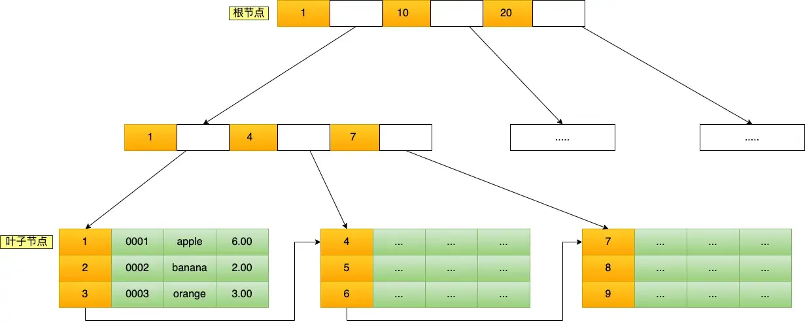
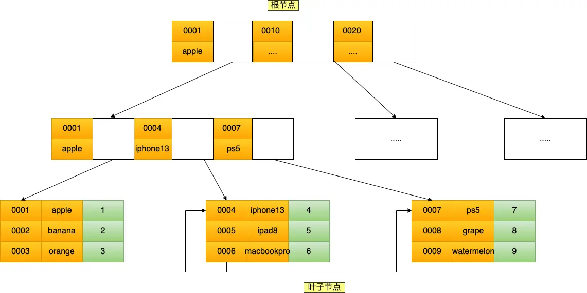
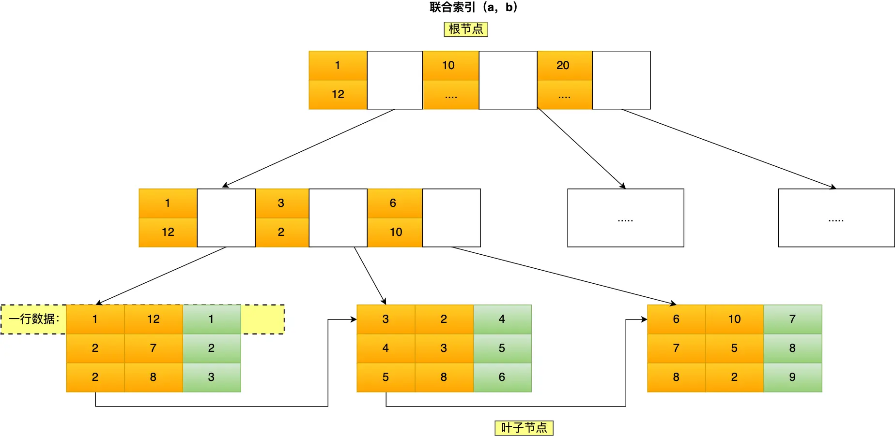
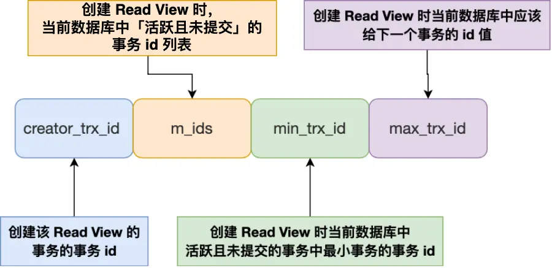
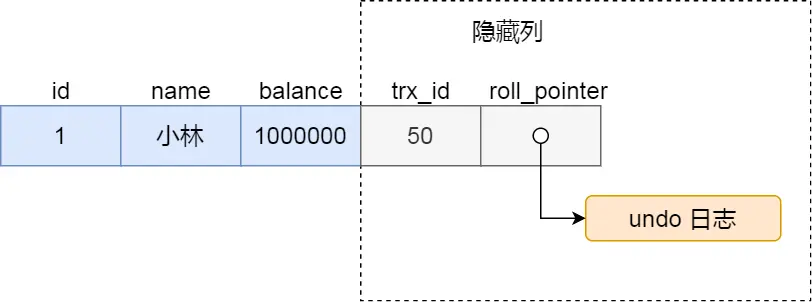
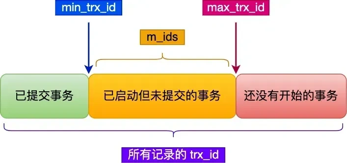

# MySQL & Redis 八股

## 重点内容

- **索引**：B+ 树的结构、聚簇索引和非聚簇索引的区别、联合索引的最左匹配原则、索引失效的场景，这块是 MySQL 面试里出现频率最高的。
- **事务和 MVCC**：四种隔离级别的区别、MVCC 是怎么用 Read View 来实现可重复读的，这是理解并发问题的核心。
- **锁**：行锁、间隙锁、临键锁各自锁的范围，以及什么情况下会升级成表锁，这块很多人答不清楚。
- **日志**：redo log、undo log、binlog 三个日志各自的作用和区别，两阶段提交是怎么保证数据一致性的。

## 索引

### 1. B+树的结构？

- B+Tree 是一种**多叉树**，**叶子节点才存放数据**，非叶子节点只存放索引，而且每个节点里的数据是**按主键顺序存放**的。
- 每一层父节点的索引值都会出现在下层子节点的索引值中，因此**在叶子节点中，包括了所有的索引值信息**。
- 并且每一个叶子节点都有**两个指针**，分别指向下一个叶子节点和上一个叶子节点，形成一个**双向链表**。

### 2. 聚簇索引和非聚簇索引的区别？

- **数据存储**
  - 在聚簇索引中，数据行按照索引键值的顺序存储，也就是说，**索引的叶子节点包含了实际的数据行**。这意味着索引结构本身就是数据的物理存储结构。
  - 非聚簇索引的**叶子节点不包含完整的数据行**，而是包含**指向数据行的指针或主键值**。**数据行本身存储在聚簇索引中**。

- **索引与数据关系**
  - 由于数据与索引紧密相连，当通过聚簇索引查找数据时，可以**直接从索引中获得数据行**，而不需要额外的步骤去查找数据所在的位置。
  - 当通过非聚簇索引查找数据时，首先在非聚簇索引中找到对应的主键值，然后通过这个主键值回溯到聚簇索引中查找实际的数据行，这个过程称为
    **回表**。

- **唯一性**
  - 聚簇索引通常是基于主键构建的，因此**每个表只能有一个聚簇索引**，因为数据只能有一种物理排序方式。
  - **一个表可以有多个非聚簇索引**，因为它们不直接影响数据的物理存储位置。

- **效率**
  - 对于范围查询和排序查询，**聚簇索引通常更有效率**，因为它避免了额外的寻址开销。
  - 非聚簇索引在使用**覆盖索引**进行查询时效率更高，因为它不需要读取完整的数据行。但是需要进行**回表**的操作，使用非聚簇索引效率比较低。

> 覆盖索引：查询所需要的所有列，**全部都在索引里面**，不需要回表去主键索引（聚簇索引）读取完整数据行，这个索引就叫覆盖索引。

### 3. 联合索引的最左匹配原则

联合索引(product_no,name)的B+树示意图如下：

可以看到，联合索引的非叶子节点用两个字段的值作为 B+Tree 的 key 值。当在联合索引查询数据时，先按 product_no 字段比较，在
product_no 相同的情况下再按 name 字段比较。

也就是说，联合索引查询的 B+Tree 是先按 product_no 进行排序，然后再 product_no 相同的情况再按 name 字段排序。

因此，使用联合索引时，存在**最左匹配原则**，也就是按照最左优先的方式进行索引的匹配。在使用联合索引进行查询的时候，如果不遵循「最左匹配原则」，联合索引会失效，这样就无法利用到索引快速查询的特性了。

比如，如果创建了一个 (a, b, c) 联合索引，如果查询条件是以下这几种，就可以匹配上联合索引：

- where a=1;
- where a=1 and b=2 and c=3;
- where a=1 and b=2;

需要注意的是，因为有查询优化器，所以 a 字段在 where 子句的顺序并不重要。

但是，如果查询条件是以下这几种，因为不符合最左匹配原则，所以就无法匹配上联合索引，联合索引就会失效:

- where b=2;
- where c=3;
- where b=2 and c=3;

上面这些查询条件之所以会失效，是因为(a, b, c) 联合索引，是先按 a 排序，在 a 相同的情况再按 b 排序，在 b 相同的情况再按 c
排序。所以，**b 和 c 是全局无序，局部相对有序的**，这样在没有遵循最左匹配原则的情况下，是无法利用到索引的。
**利用索引的前提是索引里的key是有序的**

### 4. 索引失效的场景？

1. **模糊匹配**：`like` 以`%`开头（`like %xx` / `like %xx%`），索引失效
2. 索引列上**使用函数**或**做表达式计算**，不走索引
3. 索引列发生**隐式类型转换**，等价于对列用函数，失效
4. 联合索引不满足**最左匹配原则**，索引失效
5. **`OR`条件中有字段无索引**，一般全表扫描；index_merge优化不一定生效

## 事务与MVCC

### 1. 事务的隔离级别有哪些？

1. **读未提交**：事务未提交，修改对其他事务可见
2. **读已提交**：事务提交后，修改才对其他事务可见
3. **可重复读**：事务全程读到的数据和启动时一致，**InnoDB默认级别**
4. **串行化**：读写加锁，读写冲突时串行执行（后访问的事务必须等前一个事务执行完成），隔离级别最高

### 2. MVCC实现原理

MVCC 允许多个事务同时读取同一行数据，而不会被彼此阻塞，每个事务看到的数据版本是该事务开始时的数据版本。这意味着，如果其他事务在此期间修改了数据，正在运行的事务仍然看到的是它开始时的数据状态，从而实现了非阻塞读操作。

对于「读提交」和「可重复读」隔离级别的事务来说，它们是通过 Read View 来实现的，它们的区别在于创建 Read View 的时机不同，大家可以把
Read View 理解成一个数据快照，就像相机拍照那样，定格某一时刻的风景。

- 「读提交」隔离级别是在「每个 select 语句执行前」都会重新生成一个 Read View；
- 「可重复读」隔离级别是执行第一条 select 时，生成一个 Read View，然后整个事务期间都在用这个 Read View。

Read View 有四个重要的字段：

- **m_ids**：指的是在**创建** Read View 时，当前数据库中「**活跃事务**」的事务 id 列表，注意是一个列表，“活跃事务” 指的就是，
  **启动了但还没提交的事务**。
- **min_trx_id**：指的是在创建 Read View 时，当前数据库中「活跃事务」中事务 id 最小的事务，也就是 **m_ids 的最小值**。
- **max_trx_id**：这个并**不是** m_ids 的最大值，而是创建 Read View 时当前数据库中应该**给下一个事务的 id 值**，也就是全局事务中
  **最大的事务 id 值 + 1**；
- **creator_trx_id**：指的是创建该 Read View 的事务的事务 id。

对于使用 InnoDB 存储引擎的数据库表，它的聚簇索引记录中都包含下面两个隐藏列：

- **trx_id**：当一个事务对某条聚簇索引记录进行改动时，就会把该事务的事务 id 记录在 trx_id 隐藏列里；
- **roll_pointer**：每次对某条聚簇索引记录进行改动时，都会把旧版本的记录写入到 undo
  日志中，然后这个隐藏列是个指针，指向每一个旧版本记录，于是就可以通过它找到修改前的记录。

在创建 Read View 后，我们可以将记录中的 trx_id 划分这三种情况：

一个事务去访问记录的时候，除了自己的更新记录总是可见之外，还有这几种情况：

- 如果记录的 trx_id 值**小于** Read View 中的 min_trx_id 值，表示这个版本的记录是在**创建 Read View 前已经提交**
  的事务生成的，所以该版本的记录对当前事务**可见**。
- 如果记录的 trx_id 值**大于等于** Read View 中的 max_trx_id 值，表示这个版本的记录是在**创建 Read View 后才启动**
  的事务生成的，所以该版本的记录对当前事务**不可见**。
- 如果记录的 trx_id 值在 Read View 的 min_trx_id 和 max_trx_id **之间**，需要判断 **trx_id 是否在 m_ids** 列表中：
  - 如果记录的 trx_id **在** m_ids 列表中，表示生成该版本记录的活跃事务**依然活跃**着（还**没提交**事务），所以该版本的记录对当前事务
    **不可见**。
  - 如果记录的 trx_id **不在** m_ids 列表中，表示生成该版本记录的活跃事务**已经被提交**，所以该版本的记录对当前事务**可见
    **。

这种通过「版本链」来控制并发事务访问同一个记录时的行为就叫 MVCC（多版本并发控制）。

## 锁

### 1. 行锁、间隙锁、临键锁各自锁的范围

- **记录锁**：锁住单条记录；分 S 共享锁、X 排他锁，读写互斥、写写互斥。（点）
- **间隙锁**：仅在可重复读隔离级别存在，用来解决幻读。（开区间）
- **Next-Key Lock（临键锁）**：记录锁 + 间隙锁，锁定一段范围，同时锁住记录本身。（闭区间/到∞）

### 2. 什么情况会升级为表锁

如果 update 没有用到索引，在扫描过程中会对索引加锁，所以全表扫描的场景下，所有记录都会被加锁，相当于锁住了全表。

## 日志

### 1。redo log、undo log、binlog 三个日志各自的作用和区别

- **redo log（重做日志）**：InnoDB 引擎层日志，保障事务**持久性**，故障宕机后恢复数据。
- **undo log（回滚日志）**：InnoDB 引擎层日志，保障事务**原子性**，用于事务回滚 + MVCC 版本链。
- **bin log（二进制日志）**：MySQL Server 层日志，用于**数据备份、主从复制**。

### 2. 两阶段提交是怎么保证数据一致性的

> 背景：一条事务提交时，**既要写 InnoDB 的 redo log，又要写 MySQL Server 的 binlog**。这两个日志分属不同层，如果只成功一个，就会出现主从数据不一致。
> 2PC 就是用来保证：**redo log 和 binlog 要么都成功写入，要么都不写入**。

- 两个阶段
  - **阶段1：Prepare（预备阶段）**

  1. 执行事务，数据变更写入内存缓冲区。
  2. 写 **redo log（prepare状态）**，刷到磁盘。

  > 此时 redo log 已经落盘，但**事务还没提交**。

  3. 此时如果宕机：redo log 处于 prepare，事务不算提交。

  - **阶段2：Commit（提交阶段）**

  1. 写 **binlog**，刷盘。
  2. 写 redo log 的 commit 标记（把redo从prepare改成commit）。

  > 这个标记很小，是一次极快的磁盘写入。

#### 宕机恢复的三种场景

1. **prepare之前宕机**：redo还没写，事务直接回滚，无影响。
2. **prepare完成，binlog写入前宕机**：
   重启恢复，发现redo是prepare，但**没有对应的binlog** → 事务回滚。
3. **binlog写完，redo commit标记还没写就宕机**：
   重启恢复，redo是prepare，**并且能找到对应的binlog** → 自动提交事务。

✅ 结论：

- 两阶段提交，用`prepare redo` → `写binlog` → `commit redo`的顺序，用 redo 的 prepare 标记和 binlog 是否存在做校验，实现两个日志的原子写入
  ，解决主从一致性。
- 只要 binlog 成功落盘，就一定能提交；
- binlog没落盘，事务就回滚。
  保证 **redo log 和 binlog 的事务内容完全一致**，主从复制的时候，从库回放binlog，就不会出现主库有数据、从库没有，或者反过来的不一致。

## Redis

### 一、数据结构底层（5大基础类型）
> Redis对外是5种类型，底层不是直接用C原生结构，而是**redisObject + 多种底层编码**，满足不同场景自动转换，节省内存。
1. **String**
   底层：`int`、`embstr`、`raw`
- 数字且范围合适：`int`编码；
- 短字符串≤44字节：`embstr`；
- 长字符串>44字节：`raw`；
> 编码转换：int存非数字/超出范围 → raw；embstr修改后变成raw（embstr只读）。

2. **List**
   旧版本：`ziplist` + `linkedlist`；Redis5.0之后统一用 **quicklist（压缩双向链表，节点内是ziplist）**。

3. **Hash**
   底层：`ziplist`、`hashtable`
- 元素少、值短：ziplist；
- 超过阈值 → 转hashtable。

4. **Set**
   底层：`intset`、`hashtable`
- 全是整数、数量少：intset；
- 出现非整数/数量超限 → hashtable。

5. **ZSet（有序集合）**
   底层：`ziplist`、**skiplist跳表**
- 元素少：ziplist；
- 超过阈值 → 跳表+哈希表；
> ✅跳表层高：**随机生成**，每层有1/4概率继续向上，期望O(logn)，最高32层。

---
### 二、持久化 RDB & AOF
#### RDB（快照）
原理：**二进制快照文件**，把某时刻全量数据写入磁盘。
✅优点：文件小、恢复快；
❌缺点：会丢最后一次快照到宕机之间的数据；fork子进程有内存开销。

#### AOF（追加日志）
原理：记录每一条写命令，追加到日志文件。
✅优点：数据更安全，丢数据极少；
❌缺点：文件体积大，恢复慢。

**AOF重写**：
AOF文件越写越大，后台子进程读取当前内存数据，生成精简命令，替换旧AOF；**不是读取旧AOF文件**，合并冗余指令，减少文件大小。

> 生产一般**RDB+AOF混合开启**，宕机优先加载AOF。

---
### 三、缓存三大问题（面试必背）
1. **缓存穿透**：查询**不存在的数据**，绕过缓存，直接打数据库。
   解决：布隆过滤器、空值缓存。

2. **缓存击穿**：**热点key过期**，大量并发请求瞬间打到DB。
   解决：互斥锁、永不过期。

3. **缓存雪崩**：**大量key同时过期**，大量请求压垮数据库。
   解决：过期时间加随机偏移、集群高可用、多级缓存、限流降级。

> 一句话区分：穿透=查不存在；击穿=单个热点过期；雪崩=大批量key同时失效。

---
### 四、集群架构
#### 主从复制
- **全量同步**：从库初次连接主库，主库fork生成RDB，传给从库；传输期间新命令存复制缓冲区，RDB传输完再把缓冲区命令发给从库。
- **增量同步**：断线重连后，用repl_offset偏移量，只同步断开期间缺失的命令。

#### 哨兵Sentinel
作用：监控主从，**自动故障转移**。
选主算法：
1. 过滤掉主观下线、断线的从节点；
2. 按**优先级**排序；优先级相同，选**复制偏移量最大**（数据最新）；还相同，选runid最小。

#### Redis Cluster 切片集群（哈希槽）
一共**16384个哈希槽**。
`CRC16(key) % 16384` 得到槽号，每个主节点分配一部分槽；key存到对应槽所在的主节点。
节点扩容/缩容，迁移哈希槽，不是迁移数据。

